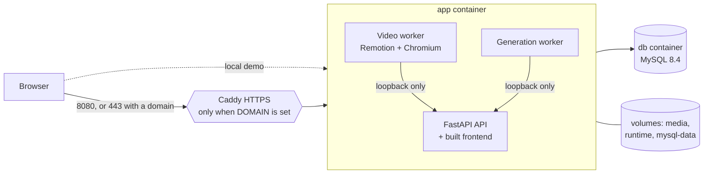

# Run TECKSTUDIO with one command: your computer or a cloud server

The command is `./scripts/demo.sh`. It works the same on a Mac, a Linux PC, Windows (WSL) and a cloud server. It needs **Docker** and nothing else: no Node, Python, MySQL or FFmpeg to install.



| Piece | What it is |
|---|---|
| `Dockerfile` | One app image: the API, the built frontend (served by the API on one port), FFmpeg, the video worker with its headless Chromium and render bundle, and the generation worker. |
| `docker-compose.yml` | Two services, `db` (MySQL 8.4) and `app`, plus an optional `https` service (Caddy) for a domain. Data lives in named volumes. |
| `scripts/demo.sh` | On first run it creates `.env.docker` with random secrets. Then it builds, starts, waits until the video worker is online, creates the demo login and prints it. |

## On your computer (before a client meeting)

1. Install **Docker Desktop**: <https://docs.docker.com/get-docker/>.
   - On a Mac, Apple Silicon and Intel both work.
   - Start Docker Desktop and give it **at least 4 GB of memory** (Settings → Resources).
2. In a terminal, from the project folder, run:

   ```bash
   ./scripts/demo.sh
   ```

   - The **first run** downloads about 1–2 GB and takes 5–15 minutes. Later starts take under a minute.
   - When it finishes, it prints the address (<http://127.0.0.1:8080>) with a demo login, and opens your browser.
   - The login is saved in `.env.docker` (`DEMO_EMAIL` / `DEMO_PASSWORD`).
3. Other commands:

   | Command | Does |
   |---|---|
   | `./scripts/demo.sh status` | Shows each service and its health check |
   | `./scripts/demo.sh logs` | Follows the app's logs |
   | `./scripts/demo.sh stop` | Stops everything; designs and uploads are kept |
   | `./scripts/demo.sh reset` | Deletes **all** demo data (asks you to type `delete`) |

   The same commands are available as `npm run demo`, `npm run demo:status` and `npm run demo:stop`.

**Windows:** run the commands in WSL (Ubuntu) or Git Bash with Docker Desktop running. Without Bash, create `.env.docker` from the template in `scripts/demo.sh`, then run `docker compose --env-file .env.docker up -d --build`.

**Show it on another device in the same room** (for example the client's laptop):

1. Set `BIND_ADDRESS=0.0.0.0` in `.env.docker`.
2. Run `./scripts/demo.sh` again.
3. Open `http://<your-computer's-IP>:8080` on the other device.

Switch `BIND_ADDRESS` back to `127.0.0.1` afterwards.

## On a cloud server (shareable link with HTTPS)

Any Linux VM with Docker works, for example AWS Lightsail or EC2, DigitalOcean, Azure, Google Cloud or Hetzner.

| Size | Use |
|---|---|
| 2 vCPU, 4 GB RAM, 30 GB disk | Demos and a small team |
| 4 vCPU, 8 GB RAM | Frequent video rendering |

1. **Create the server.** Ubuntu 24.04 LTS works. Open ports **22, 80 and 443** in its firewall or security group.
2. **Point your domain** (e.g. `studio.example.com`) at the server's public IP with a DNS **A record**.
3. **On the server:**

   ```bash
   curl -fsSL https://get.docker.com | sudo sh        # installs Docker Engine + Compose
   sudo usermod -aG docker "$USER" && newgrp docker
   git clone <your repository URL> teckstudio && cd teckstudio
   ./scripts/demo.sh                                  # first run: creates .env.docker and starts on 127.0.0.1:8080
   ```

4. **Turn on HTTPS:**
   1. Edit `.env.docker` and set `DOMAIN=studio.example.com`. Leave `BIND_ADDRESS=127.0.0.1`, so only Caddy is public.
   2. Run `./scripts/demo.sh` again.
   3. Caddy gets a Let's Encrypt certificate automatically and serves `https://studio.example.com`.
5. **Share the URL and the demo login.** Change the demo password after the meeting: either log in and change it, or set a new `DEMO_PASSWORD` before the first start.

**Updating:** run `git pull && ./scripts/demo.sh`. This rebuilds the image. The database, uploads and renders stay in their volumes, and database migrations run when the API starts.

**Without a domain** (a quick, temporary demo only):

- Set `BIND_ADDRESS=0.0.0.0` and open port 8080. The site is then plain HTTP, so passwords travel unencrypted.
- Limit port 8080 to your client's IP address, and close it afterwards.

### Backups

```bash
# Database (while running)
docker compose --env-file .env.docker exec db sh -c 'mysqldump -u root -p"$MYSQL_ROOT_PASSWORD" --single-transaction teckstudio' > teckstudio-$(date +%F).sql
# Uploads, generated media and rendered videos
docker run --rm -v teckstudio_media:/media -v teckstudio_runtime:/runtime -v "$PWD":/backup busybox \
  tar czf /backup/teckstudio-files-$(date +%F).tgz /media /runtime
```

Keep `.env.docker` with your backups. It holds the database and signing secrets. Restoring data without it means resetting passwords and logins.

## Security notes

- **Secrets.** They are generated per installation into `.env.docker`, which is git-ignored and readable only by you. Nothing secret is baked into the image; the video worker's key comes from `WORKER_SECRET`.
- **Worker routes.** `/api/internal/*` answers only callers inside the app container (`INTERNAL_API_LOOPBACK_ONLY`). Caddy and the internet get a 404, even with a leaked worker secret.
- **Database.** MySQL is not published on any port; only the app container reaches it.
- **Open registration.** Anyone who can open the URL can register an account. For a demo, share the URL only with the client.
- **Not hardened for production yet.** Before real customers use it, work through the access-rule and abuse-control items in [PRODUCT_DEEP_DIVE](PRODUCT_DEEP_DIVE.md#prioritized-improvements): sharing and media access rules, rate limits and monitoring.
- **AI is optional.** Manual design, templates, PNG/PDF export and motion video work without any AI key. To enable AI, add keys to `.env.docker` (`GEMINI_API_KEY`, `OPENAI_API_KEY`, …) and run `./scripts/demo.sh` again.

## Troubleshooting

| Symptom | Fix |
|---|---|
| "Docker is installed but not running" | Start Docker Desktop and wait for the whale icon to settle. |
| "port is already allocated" | Another program uses the port. `./scripts/demo.sh` now moves to the next free port by itself and saves it as `APP_PORT` in `.env.docker`; the printed address shows which one. To choose a port yourself, set `APP_PORT`. |
| The first build fails while downloading | Re-run it: Docker reuses the finished steps. On a corporate network with a TLS-inspecting proxy, set `BASE_IMAGE=<an Ubuntu 24.04 image that trusts the proxy's certificate>` in `.env.docker` and run again. If the render browser cannot be downloaded, set `REMOTION_BROWSER_EXECUTABLE` in that base image to an installed Chrome headless shell. |
| Waits forever for the video worker | Run `./scripts/demo.sh logs`. Give Docker Desktop at least 4 GB of memory. |
| Login says the account doesn't exist | The Docker stack has its own database. Use the demo login from `.env.docker`, or register. Accounts from `./scripts/start_local.sh` live in a different database. |
| HTTPS certificate not issued | Check that the DNS A record points at the server and that ports 80 and 443 are open. Then see `docker compose --env-file .env.docker logs https`. |

## What was verified (October 9, 2026)

The checks below ran on Linux amd64 with Docker 29 and Compose v5. They were **not** run on macOS Docker Desktop or on a real cloud VM with a public domain.

- **First start:** from a clean state, `./scripts/demo.sh` built the image, started MySQL and the app, waited for all four health checks, created the demo login and printed it. With the image already built, this took about 1 minute 40 seconds.
- **Browser flow on the real stack** (no mocks): log in, create a PCS Digital poster in Design Studio, the editor opens and autosaves. Then create a motion video and click **Render MP4**: the video worker rendered a 1080×1080 H.264 file (15.6 s) that downloads from the app.
- **Restarts:** `stop`, then `demo.sh` again, kept the projects and the rendered video. Running `demo.sh` a second time reuses the secrets and the login. `reset` refuses without typing `delete`.
- **HTTPS profile:** with `DOMAIN=localhost`, Caddy served the app over HTTPS. Worker routes returned 404 through it and from the host.
- **Not exercised here:** the Remotion browser download. This sandbox blocks `remotion.media`, so the test build used `REMOTION_BROWSER_EXECUTABLE`; on a normal network the build downloads the browser itself. A real Let's Encrypt certificate needs a public domain, so that wasn't tested either.
- **Image size:** about 3.5 GB (Chromium, FFmpeg, Node and Python dependencies).

## Docker or native?

| | Docker (`./scripts/demo.sh`) | Native (`./scripts/run_local.sh`) |
|---|---|---|
| Installs needed | Docker only | Node 22.12+, Python 3.10+, MySQL, FFmpeg |
| Best for | Client demos, cloud servers, Windows and Linux | Day-to-day development with hot reload |
| Address | <http://127.0.0.1:8080> (one port) | <http://127.0.0.1:5173> (Vite) + API on 5001 |
| Data | Docker volumes | `.local/` and `backend/media/` |

The two keep **separate databases**. See [LOCAL_SETUP](LOCAL_SETUP.md) for the native path.
