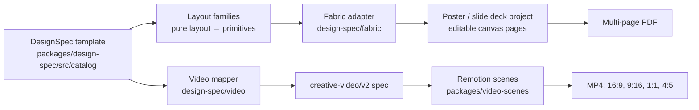

# Design Studio: templates, assets and motion graphics

A Design Studio template can become a poster, a slide deck or a motion video. The main use cases are **teaching tech concepts** and **real-estate marketing**.

## How it fits together



- **DesignSpec** (`packages/design-spec`): a spec has `format` (one size registry), `theme` (colour and font tokens) and `pages`. Each page names a **layout family** and fills that family's named **slots**. A spec with one page is a poster; a spec with several pages is a deck.
- **Layout families.**
  - Tech: `concept-cards` (numbered, grid, stack, hero), `architecture-flow` (flow, steps, timeline), `code-explainer` (explainer, cheatsheet), `comparison`.
  - Real estate: `listing-hero`, `open-house`, `property-feature-grid` (mosaic, gallery), `just-sold`.
- **Every family lays out in every format.** The families are pure functions, so tests can check every family × format × theme for text outside the canvas and overlapping text.
- **Once a project is created, its Fabric JSON is the source of truth.** The spec is kept in `creative_context.design_spec` as a record of where the project came from.
- **The 65 older tech poster templates** are adapted onto the families by `adaptLegacyPosterTemplate`. They now keep their own size and layout instead of all rendering at 800×1132.

## Using it

- **Dashboard → Design Studio** (`/design`). Filter by *Tech teaching* or *Real estate* and by output. Pick a template, then a format and theme, then choose **Create poster**, **Create slide deck** or **Create motion video**.
- **Decks.** The Pages panel shows the slides.
  - **Export all as PDF** writes one PDF page per slide, in order. Print formats (A4, A3, Letter) use their physical size.
  - **Make motion video from template** builds a video from the template's content. Text you edited on the canvas is not included.
- **Video editor.** Available scene types: slide, code walkthrough, property listing (Ken Burns photo pans), animated stats, logo intro/outro, plus the original types.
  - Per scene you can set easing, staggered reveals and a transition: fade, slide, wipe, clock-wipe or zoom.
  - Formats: 1920×1080, 1080×1920, 1080×1080 and 1080×1350. Theme can be *Classic paper* or any design theme.

## Motion contract (creative-video/v2, additive)

These fields are all optional, so existing specs render exactly as before.

| Field | Meaning |
|---|---|
| `output.preset` | Adds `square-1080` and `portrait-4x5` |
| `style.themeId` | Theme colours and fonts; if absent, the original paper look |
| `scene.transitionIn` | `{type, direction?, durationFrames 6–30, timing}`. The scene overlaps the previous one: `start = previousEnd − durationFrames` |
| `scene.easing`, `scene.stagger` | Entrance curve; items reveal one after another |
| Scene types `slide`, `code`, `listing`, `stats`, `logo` | Described in `packages/lesson-video/src/creative.ts` |

The TypeScript contract and `backend/services/lesson_spec.py` share `packages/lesson-video/tests/fixtures/creative-motion.json`, which includes the expected timing plan, and both are tested against it.

## Assets

- **Icons.** 122 vendored icons live in `packages/design-spec/src/icons/generated`. They include tech (server, database, queue…), real estate (bed, bath, sq ft, floor plan, map pin, key…) and tech logos.
  - Regenerate them with `npm run icons:vendor` after editing `required.json`.
  - Licences are recorded per icon. Share-alike logos are rejected.
  - Logos are trademarks; see [THIRD_PARTY_NOTICES](../THIRD_PARTY_NOTICES.md).
- **Fonts.** Inter, Outfit, JetBrains Mono and Playfair Display are self-hosted through `@fontsource` (OFL). The editor and the renderer use the same files.
- **Derived photo sizes.** `backend/media/asset-library-full` and `-thumbnails` are no longer tracked in git. They are rebuilt from `backend/media/asset-library` at startup, or on demand with `python backend/curated_asset_seed.py --derivatives`. The old copies remain in git history.
- **Real-estate photos.** `python scripts/fetch_cc0_photos.py` downloads a CC0 / public-domain set from Wikimedia Commons.
  - It reads licence, author and source from Commons' own metadata and writes `ATTRIBUTION.json` with sha256 hashes.
  - The seeder then uses that provenance instead of placeholder licence text.
  - It needs network access to `commons.wikimedia.org` and `upload.wikimedia.org`.
  - Spot-check source pages before publishing.
- **Existing photos.** The provenance of the original 96 photos in `asset-library` is still undocumented; they are labelled "user-provided reference". Confirm their licences before any public use.

## Checks

```bash
npm run test               # design-spec + video contract (node --test)
npm run verify:design      # real Fabric in headless Chrome: 116 template × format cases, contact sheet
npm run verify:motion      # key-frame stills for every preset + one MP4
cd backend && pytest test_creative_spec_parity.py test_design_video_parity.py \
  test_reference_derivatives.py test_real_estate_attribution.py
```

`verify:*` use `.local/video-runtime.json` (`npm run video:prepare`), `CHROME_PATH`, or a preinstalled Playwright headless shell. Output goes to `.local/tests/`.

## Known limits / next steps

- Template photos are placeholders. In videos, listing scenes show a photo slot until you upload photos in the video editor. Design images are not yet mapped automatically to owned media assets (`toCreativeVideo`'s `resolveImage` hook is ready for that).
- "Make motion video" uses the template content, not later canvas edits.
- The older Fabric timeline video export (browser frames → FFmpeg) is unchanged and separate from Remotion.
