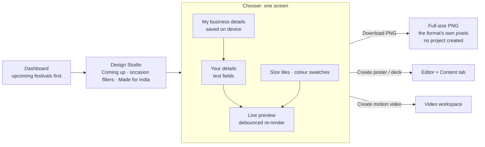

# Design Studio review: user flows, Indian templates and the Indic-language plan

Reviewed October 9, 2026. Covers the Design Studio path (Dashboard → `/design` → editor or video) and the shared `@teckstudio/design-spec` package. Evidence: source reading, the design-spec and video test suites, backend parity tests, the real-Fabric render check (`npm run verify:design`, 225 cases), Remotion stills of the new templates, and screenshots of a production build with the API mocked.

## Summary

- **Goal:** make poster design easy for Indian users (shop owners, families, builders, coaching centres), and prepare for Telugu, Hindi, Kannada, Tamil and Malayalam.
- **Before:**
  - The Studio only had tech-lesson and US-style real-estate templates ($, beds, US phone numbers).
  - You picked a size and theme from text drop-downs, then had to find the editor's Content tab to change any text.
- **Now:**
  - 23 Indian starters on three new layout families.
  - Seven Indian themes with festive decorations.
  - A "Coming up" festival row.
  - A one-screen flow: pick a template, type your details with a live preview, then download a PNG or create.
  - Business details are remembered on the device.
- **Indic languages are not implemented.** This review lays the groundwork: `locale` on designs, a glyph-coverage hook in the layout engine, and Indian number grouping. It also sets out a phased plan with the main technical risk: Fabric.js text shaping.

## Findings on the user flow

| # | Finding | Evidence | Status |
|---|---|---|---|
| 1 | No templates for the main Indian poster occasions: festivals, shop offers, menus, admissions, invitations, ₹ / BHK / RERA listings | `catalog/` had tech and US real estate only | **Fixed**: 23 starters, see below |
| 2 | You could not enter your own text before landing in the full editor | Chooser had only format and theme `<select>`s | **Fixed**: "Your details" fields with a live preview |
| 3 | Repeat users retype the shop name and phone on every poster | No memory of business details | **Fixed**: "My business details", saved on the device and applied per layout |
| 4 | Getting a shareable image needed the editor and its export panel | — | **Fixed**: **Download PNG** in the chooser for single-page designs; disabled until photo placeholders are filled |
| 5 | Size and colours were picked from text lists | `<select>` of ids and labels | **Fixed**: size tiles with an aspect icon; colour swatches |
| 6 | Deck preview showed only slide 1 | "The preview shows the first slide" | **Fixed**: slide strip; click to preview any slide |
| 7 | Browsing was a flat grid with two filters | Vertical: Tech/Real estate | **Fixed**: occasion filters, "Made for India", sections grouped by use case, regional search terms (Deepavali, pelli, gruhapravesam…) |
| 8 | ₹ fell back to a system font | Outfit and JetBrains Mono have no U+20B9; video loaded only `latin` subsets | **Fixed**: text a heading font cannot draw uses the body font (Inter); video loads `latin-ext` and adds an Inter fallback |
| 9 | Videos made from designs opened with "DISCOVER SOMETHING NEW" | Video header falls back to a generic line when `brand.name` is empty | **Fixed**: header uses the greeting's sender, the shop name or the occasion |
| 10 | Too many entry points on the dashboard | Design Studio, Creative Studio, AI poster, Quick Create sizes and Lesson Video all start "a poster"; Creative Studio has its own poster compiler with an Arial fallback | **Open**: see recommendation R1 |
| 11 | Dashboard template cards show a generic icon, not a preview | `Dashboard.tsx` featured cards | **Open**: R2. Dashboard now lists upcoming festivals first |
| 12 | Photos, prices and lists can only be edited after creating | The chooser edits text slots of slide 1 | **Open**: R3 |
| 13 | **Apply to page** in the Content tab replaces manual position and style edits | Documented limit in [DESIGN_STUDIO](DESIGN_STUDIO.md) | Unchanged |

### Recommendations not done in this change

- **R1. One "create" entry.**
  - Make Design Studio the single template path on the dashboard.
  - Fold Creative Studio's brand catalogue into the business profile, or a brand-kit picker in the chooser, and retire its separate poster compiler.
  - Keep "blank canvas" sizes as a secondary row.
- **R2. Real thumbnails on the dashboard.** Reuse the Studio's lazy `designThumbnail` in a code-split component, so `fabric` does not load on first paint.
- **R3. Photo step in the chooser.** Upload or pick a library photo for the image slot before creating. The Content tab already has the picker (`ImagePicker` in `DesignContentPanel.tsx`).
- **R4. Share links.**
  - After **Download PNG**, offer the Web Share API (`navigator.share` with files) on mobile, so the image goes straight to WhatsApp.
  - This needs a mobile check; it was not done here.
- **R5. Brand logo on framed layouts.**
  - Festival greetings and invitations skip the corner brand mark, because it would cross the frame.
  - Add a logo slot above the sender line.

## What changed

### Shared package (`packages/design-spec`)

- **New layout families** (`layout/families/occasion.ts`).
  - The geometry tests lay out each family/variant used by a starter in every format, with the first and last theme, and check for text outside the page and overlapping text.
  - Text that a layout has no room for is reported as a validation warning, not dropped silently (see "Review follow-up").
  - `festival-greeting` (`centered`, `photo`): lead-in, big greeting, ornament, message, then a sender and contact line pinned to the bottom. The text block is measured and centred vertically.
  - `offer-promo` (`burst`, `menu`):
    - `burst`: offer badge on the product photo plus ₹ price tiles.
    - `menu`: dotted price rows with a combo-offer pill.
    - Both have a validity / address / phone panel and a fine-print line.
  - `event-invite` (`classic`, `photo`): double frame, occasion, names, invitation line, date, time / muhurtham, venue, hosts and RSVP.
- **Indian themes:** `marigold`, `diwali-night`, `rangoli`, `kasavu`, `shaadi-maroon`, `tiranga` and `bazaar`.
  - New decorations:
    - `toran` (bunting), `kolam` (dotted frame), `kasavu` (gold bands) and `tiranga` (saffron and green bands) stay inside the page margins.
    - `mandala` (corner rings) is faint background art (22% opacity) that sits behind content.
  - A test enforces contrast: text ≥ 7:1, muted text ≥ 4.5:1, primary and on-primary ≥ 3:1.
  - The themes are registered in the video contract (`VIDEO_THEME_IDS` and the JSON schema), so the backend accepts them.
- **Listings:**
  - `facts.bhk` ("3 BHK", shown instead of beds) and `facts.facing` (compass icon).
  - Locale-aware digit grouping (`en-IN`: 1,20,000).
  - An optional `legal` fine-print slot on `listing-hero` for the RERA number.
- **`spec.locale`:** a BCP 47 tag, validated. All Indian starters use `en-IN`.
- **Profile:** `applyBusinessProfile(spec, {name, phone, address})` writes saved details into each layout's slots, clipped to slot limits:
  - greeting: sender and contact
  - offer: shop name, address and phone
  - invite: RSVP
  - listing: agent phone and brand name
- **Seasons:** `template.season` (months) and `upcomingTemplates(templates, today)` power the "Coming up" row and the dashboard order.
- **Glyph coverage:** `fontCovers(family, text)`. The layout engine moves text to the body font when the role's font lacks a glyph. This is the hook the Indic phase extends.
- **Icons:** 25 more vendored Tabler icons (147 total), including compass, rupee, gift, candle, gated community, metro, gym and restaurant.
- **Video mapping:**
  - The new families map to motion scenes (title, statement, split-image with photo, outro with contact).
  - The purpose is taken from the layouts, so an admissions offer is a promotion even on a navy theme.

### App (`frontend/src/features/design`)

- `DesignStudio.tsx`:
  - occasion filters and the "Made for India" toggle, both kept in the URL
  - the "Coming up" row
  - sections grouped by use case
  - the redesigned chooser: profile, quick fields, live preview, slide strip, size tiles, colour swatches, **Download PNG**, sticky actions
- `businessProfile.ts`: device storage wrapped in try/catch, so the Studio still works when storage is blocked.
- `designProject.ts`:
  - thumbnails for any page, cached with a cap (live preview adds an entry per edit)
  - `downloadDesignPng`
- Content tab: BHK, Facing and "Lot / plot size" fields. Offer items edit as name + ₹ price.
- Dashboard: upcoming-festival templates first; updated copy.

### Indian starter catalogue (`catalog/india.ts`)

| Use case | Templates |
|---|---|
| Festival greetings | Diwali, Sankranti & Pongal (photo), Ugadi, Holi, Onam, Independence Day, Republic Day, Ganesh Chaturthi (photo), Bathukamma, Dussehra & Navratri, Eid Mubarak, Christmas |
| Offers and shops | Festive sale offer, Grand opening, Tiffin centre menu (A4) |
| Education | Admissions open (JEE / NEET / Foundation) |
| Invitations | Wedding, Housewarming (Griha Pravesh), Naming ceremony (photo) |
| Real estate | 3 BHK apartment (₹ Cr, facing, RERA line), Open plots (₹ / sq yd, DTCP), Weekend site visit, Residential project deck (4 slides) |

Names, phone numbers (`+91 90000 12345`) and addresses are samples. The RERA line reads "add yours here" on purpose.

## Hiring posts and PCS Digital (October 9, 2026, later the same day)

- **New layout family `job-posting`** (`layout/families/hiring.ts`):
  - `single`: kicker, role, subtitle, skill chips, key-fact tiles with icons, an apply bar with a tag, and fine print.
  - `openings`: up to 8 role rows.
  - New vertical `hiring` and a **Hiring** filter in the Studio. Nine more icons, 156 in total.
- **Templates:**
  - Generic: one role, multiple openings, walk-in drive, internship, employee referral.
  - Four **PCS Digital** templates (`catalog/pcsDigital.ts`), modelled on the company's own posts: immediate hiring (SAP), a role with skills (Databricks), current openings, and festival wishes.
  - They use the logo's blue and orange through `brand` colours and `contact@pcsdigitaltech.com`.
- **`linkedInCaption(spec)`** writes the post text in the same structure, and the chooser has **Copy LinkedIn caption** for job posts.
- **Logo:** the Content tab has a **Brand** section (name and logo) that applies to every page.
- **Guide:** [PCS_DIGITAL_POSTING_GUIDE](PCS_DIGITAL_POSTING_GUIDE.md).

### Review follow-up

An independent review of the first commit found no critical issues. Fixed:

- **Dropped text.** Invitation and greeting stacks dropped entries silently when space ran out, e.g. time and venue on a square naming-ceremony card with a long venue.
  - The big title now shrinks first.
  - `validateDesignSpec` warns for any non-empty text slot the layout could not place.
  - That check also exposed a **pre-existing bug**: the takeaway and verdict bars on tech posters were tagged as slot `cta`, so canvas edits to them were never read back into the design or the video. `ctaBar` now takes the real slot name, and a sync test covers it.
- **Profile layout list.** The chooser asks `usesBusinessProfile()` instead of keeping its own copy of the list.
- **Live previews.** They use a separate cache of eight, renders that were superseded while queued are skipped, and slide thumbnails are keyed by their own page.
- **Download PNG.**
  - It uses a Blob URL instead of a data URL, because large print sizes can exceed what browsers accept in a download data URL.
  - The file name keeps letters in any script.
- **Offer items.** New items start with an empty price, not a bare "₹".
- **Chooser accessibility.**
  - Focus moves into the dialog, so Escape works at once, and returns to the card on close.
  - The preview image has alt text.
  - Over-limit fields are `aria-invalid`, with a visible "Too long" message linked to the field.
- **Invitation videos.** The header shows the names, not the "Together with their families" lead-in.

## Next phase: Indian languages (plan, not implemented)

**Target:** English plus Telugu, Hindi, Kannada, Tamil and Malayalam.

There are two separate tracks:

- **Design content in Indic scripts.** This is the hard part, and the reason people will use the product.
- **App UI localisation.** This is routine.

### Risks to settle first (spike, about one week)

1. **Fabric.js text shaping.**
   - Indic scripts need complex shaping: conjuncts, reordered vowel signs, marks above and below.
   - Browsers do this correctly when a whole line is drawn with one `fillText` call.
   - Fabric 5 draws character by character in some paths: letter spacing (`charSpacing`), per-character styles and justified text. It also measures widths per grapheme for wrapping and cursor placement.
   - Expected symptoms: broken conjuncts, wrong wrap points, and the editing cursor in the wrong place.
   - **Spike:** render, wrap, edit and select Telugu, Hindi, Kannada, Tamil and Malayalam sample text in a Fabric `Textbox` with real fonts. Repeat with letter spacing 0 and no mixed styles. Record which paths work.
   - **Outcomes:**
     - (a) Fabric is fine when Indic text has no letter spacing and no per-character styles. Enforce that for Indic text.
     - (b) Editing is broken but display is fine. Edit in an HTML overlay or the Content tab.
     - (c) Display is broken. Evaluate a Fabric upgrade or draw Indic text as pre-shaped images. This one is unlikely.
2. **Fonts.** None of the bundled fonts (Inter, Outfit, Playfair Display, JetBrains Mono) contain any Indic script. Pick fonts that also contain Latin, so mixed lines ("Happy దీపావళి") render in one font:

   | Option | Scripts | Notes |
   |---|---|---|
   | **Baloo 2 family** (Ek Type, OFL) | Baloo 2 (Devanagari), Baloo Tammudu 2 (Telugu), Baloo Tamma 2 (Kannada), Baloo Thambi 2 (Tamil), Baloo Chettan 2 (Malayalam) | Same friendly display voice in all five scripts, plus Latin. Good for festival and shop posters |
   | **Anek** (Ek Type, OFL, variable width) | Anek Devanagari / Telugu / Kannada / Tamil / Malayalam | Condensed widths help long Indic headlines fit |
   | **Noto Sans / Noto Serif** per script (OFL) | All five | Safest coverage and a neutral body text. Script fonts may not include full Latin; check per font |

   - **Recommendation:** Baloo 2 family for headings and Noto Sans for body text.
   - Check the `@fontsource` package names and subsets when implementing.
   - Fonts add weight: load each script's fonts only when a design uses that script.
3. **Text measurement.** `estimateLines` assumes Latin glyph widths (about 0.52–0.56 em) and line heights of 1.08–1.3.
   - Telugu, Kannada and Malayalam have deep marks below the line; Malayalam words are long.
   - Needed:
     - per-script width factors and minimum line heights (start at about 1.4–1.5 and calibrate with `verify:design`)
     - character limits counted in grapheme clusters (`Intl.Segmenter`), not UTF-16 units
     - limits about 1.3–1.5× higher for Indic text

### Implementation steps

| Step | Work | Done when |
|---|---|---|
| 1. Script detection | `detectScript(text)` by Unicode block: Devanagari U+0900–097F, Tamil U+0B80–0BFF, Telugu U+0C00–0C7F, Kannada U+0C80–0CFF, Malayalam U+0D00–0D7F | Unit tests for each script and for mixed lines |
| 2. Script fonts | Extend `fonts.ts`: per-script heading and body families. Extend `fontCovers` to know script coverage. The engine picks the script font from the same hook that already swaps the ₹ font. Fabric `fontFamily` stays a single family name, because the editor's font picker expects one | A Telugu greeting renders in Baloo Tammudu 2 in the editor, the thumbnail, the PNG and the video |
| 3. Measurement | Per-script `GLYPH_WIDTH` and line-height floor. No `uppercase` or `letterSpacing` on Indic text (scripts have no case, and spacing breaks shaping) | Geometry tests pass for Indic fixtures in every format; `verify:design` has no overflow with real fonts |
| 4. Indic starters | Native-language versions of the festival, offer and invite templates, e.g. Telugu "సంక్రాంతి శుభాకాంక్షలు", Hindi "दीपावली की हार्दिक शुभकामनाएं", Kannada "ದೀಪಾವಳಿ ಹಬ್ಬದ ಶುಭಾಶಯಗಳು", Tamil "இனிய தீபாவளி நல்வாழ்த்துக்கள்", Malayalam "ഓണാശംസകൾ". **Every string is reviewed by a native speaker before release** | A language filter in the Studio; each starter checked by a reviewer |
| 5. "Copy in another language" | Next to "Create copy in this format" in the Content tab: create a copy with `locale` set. Optional AI-assisted translation of slot text, marked as needing review. Re-layout so the new lengths fit | A Telugu copy of an English poster opens with Telugu fonts and no overflow warnings |
| 6. Typing Indic text | Rely on OS keyboards first. Optional transliteration input ("deepavali" → దీపావళి) as a stretch | Users can enter text without an external tool |
| 7. Video | Remotion runs in Chromium (HarfBuzz shaping), so the video side mainly needs script fonts in `requiredFonts` and per-script `@fontsource` imports in `video-scenes`. Narration and TTS per language later | Key-frame stills for each script in `verify:motion` |
| 8. UI localisation | Externalise Studio, chooser and Content-tab strings (e.g. `react-i18next`), then the rest of the app. Format numbers and dates with `Intl` using the user's locale (`te-IN`, `hi-IN`, …) | Studio usable end to end in Telugu and Hindi |

**Order:** spike (risk 1) → steps 1–3 for Telugu and Hindi → step 4 for those two → Kannada, Tamil and Malayalam → steps 5–8.

### Groundwork already in place

- `DesignSpec.locale` (validated BCP 47) and `LayoutContext.locale`. Fact chips already format numbers by locale.
- `fontCovers` plus the engine's role-font fallback: the single place where script fonts plug in.
- Character limits and overflow warnings already exist per slot. The Indic work changes how they count, not where they are enforced.

## Verification

| Check | Result |
|---|---|
| `npm run test` (design-spec + video contract) | 41 + 14 tests pass (after the hiring work) |
| `pytest test_creative_spec_parity.py test_design_video_parity.py test_lesson_video.py` | 27 pass (backend accepts the new themes and layouts through the shared JSON schema) |
| `npm run verify:design` (real Fabric in headless Chrome) | 269 cases, 0 issues (after the hiring work); contact sheet reviewed |
| Remotion stills for the sale, 3 BHK and wedding templates | Render with the new themes; ₹ draws in Inter |
| `tsc -b`, `vite build`, `eslint src/features/design` | Clean (existing Dashboard warnings unchanged) |
| Studio, chooser, deck strip, mobile width, PNG download | Checked by screenshot against a production build with the API mocked. Project creation against the real API was **not** exercised here |
