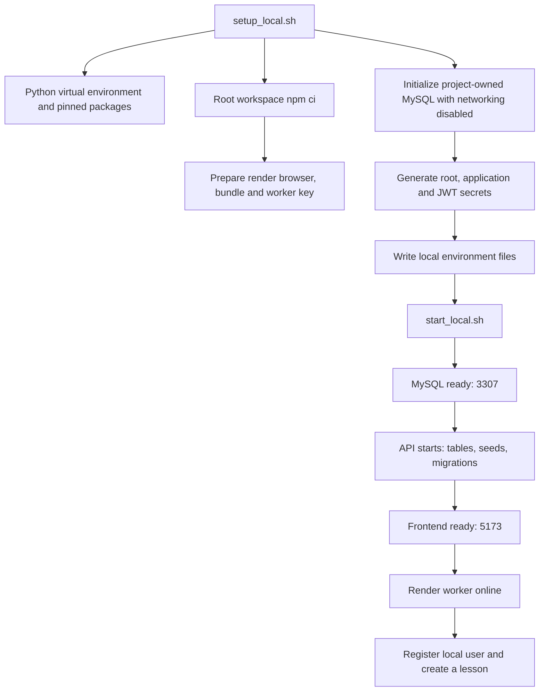

# Run TECKSTUDIO locally

The complete local stack is **browser → React/Vite → FastAPI → MySQL**, with a **local Node/Remotion worker** for Lesson Video, **FFmpeg** for the existing canvas exporter and local disk for media. There is no required Redis, cloud database or hosted AI service for manual authoring. Initial package/browser installation requires internet. Remotion lessons use packaged fonts; some existing canvas fonts and connected assets use internet at runtime. See [Create lesson videos locally](REMOTION_LOCAL_GUIDE.md) for the new workflow.

## Recommended path on this Mac

The supplied machine has Node **24.19.0**, npm **11.17.0**, Homebrew Python **3.12**, MySQL **9.3.0**, and FFmpeg **9.0.1**. `/usr/bin/python3` is **3.9.6**, which is too old for this source. Use the project's `.venv` or explicitly select Homebrew Python.

For another Mac, install prerequisites first:

```bash
brew install node@24 python@3.12 mysql ffmpeg
```

Ensure the installed executables are on `PATH`; Homebrew prints instructions for keg-only packages. Use the same MySQL major version for an existing data directory; changing the binary is a database upgrade, not a routine restart. The launcher was exercised on Apple Silicon macOS; Linux and Windows instructions below are not tested on this machine.

From the project root:

```bash
./scripts/setup_local.sh
./scripts/start_local.sh
```

`setup_local.sh` selects a compatible Python, creates `.venv`, installs `backend/requirements-local.lock`, runs `npm ci` against the root workspace lockfile, prepares the Remotion browser/bundle and private worker key, and initializes a new local database. Managed existing data is preserved. If an unmanaged `backend/.env` or database directory is found, initialization stops rather than overwriting it. Use the manual path in that case. You can select Python with `TECKSTUDIO_PYTHON=/absolute/path/to/python3.12 ./scripts/setup_local.sh`.

`start_local.sh` starts four services in order: MySQL, API, frontend and render worker. It waits for readiness and logs to `.local`, including `.local/renderer-process.log`. It intentionally runs FastAPI without auto-reload for a stable teaching session. Ctrl+C stops its child services gracefully. Keep the terminal open while using the product.

To stop from a different terminal, run `./scripts/stop_local.sh`. This asks the managed launcher to shut down its own children; it does not kill unrelated processes. Restart with `./scripts/start_local.sh`.

| Service | Address | Purpose |
|---|---|---|
| Product | [127.0.0.1:5173](http://127.0.0.1:5173) | Register, create and edit |
| Visual guide | [127.0.0.1:5173/guide.html](http://127.0.0.1:5173/guide.html) | Flows, architecture and recipes |
| API documentation | [127.0.0.1:5001/docs](http://127.0.0.1:5001/docs) | Interactive OpenAPI reference |
| API health | [127.0.0.1:5001/health](http://127.0.0.1:5001/health) | Correct health route; `/api/health` does not exist |
| Database health | [127.0.0.1:5001/api/health/database](http://127.0.0.1:5001/api/health/database) | Real database connectivity |
| Render worker health | [127.0.0.1:5001/api/health/lesson-video](http://127.0.0.1:5001/api/health/lesson-video) | Recent worker heartbeat |
| Isolated MySQL | `127.0.0.1:3307` | Database `teckstudio_local` |



## What is stored where

| Path | Contents | Back up? |
|---|---|---|
| `backend/.env` | Database credentials, JWT secret, optional API keys | Yes; keep private |
| `frontend/.env.local` | Browser API address; no secrets | Yes |
| `.local/mysql/` | Dedicated MySQL data files | Yes, after clean shutdown |
| `.local/mysql-admin.cnf` | Local database root credentials | Yes; private, mode 600 |
| `.local/stack.json` | Launcher initialization marker | Yes |
| `.local/*-process.log`, `.local/mysql.log` | Local service logs | Useful for troubleshooting |
| `backend/media/` | Bundled media, uploaded images, generated assets | Yes, including user uploads |
| `/tmp/teckstudio/video-renders/` | Existing canvas exporter: temporary renders, default 24-hour retention | Download final videos elsewhere |
| `.local/video-artifacts/` | Lesson Video: job attempts, completed MP4/poster/manifest | Yes, together with MySQL |
| `.local/video-bundles/`, `.local/video-runtime.json` | Versioned render bundles and runtime identity | Retain while snapshots may retry |
| `.local/video-worker.key` | Private worker credential | Yes; keep private |
| `.venv/`, `node_modules/`, `frontend/dist/` | Re-creatable dependencies/build | No |

`.local`, environment files, virtual environments and generated media paths are ignored by `.gitignore`. Do not share your entire project folder as a ZIP without excluding credentials and private uploads. Save final exported teaching files outside the temporary render directory.

For a simple backup, stop the launcher and copy `.local/`, `backend/.env`, `frontend/.env.local`, and `backend/media/` into your private backup location. Restore data with a compatible MySQL binary. Do not delete `.local` to solve a startup error; it contains your database. For a logical dump while running:

```bash
mysqldump --defaults-extra-file=.local/mysql-admin.cnf --single-transaction --no-tablespaces teckstudio_local > /your/private/backup/teckstudio.sql
```

Replace that backup path with an existing private directory. Restore logical dumps into a separately prepared database, preserving the corresponding media files.

## Manual path: existing MySQL, Linux or Windows

Install Node 22.12+ (24 recommended), Python 3.10+ (3.12 tested), MySQL 8/9 and FFmpeg. The app uses MySQL-specific SQL/migrations; SQLite is not a drop-in substitute.

1. In a MySQL administrator session, create a development database and user. Replace the password before running:

```sql
CREATE DATABASE teckstudio CHARACTER SET utf8mb4 COLLATE utf8mb4_unicode_ci;
CREATE USER 'teckstudio'@'localhost' IDENTIFIED BY 'REPLACE_WITH_RANDOM_PASSWORD';
CREATE USER 'teckstudio'@'127.0.0.1' IDENTIFIED BY 'REPLACE_WITH_RANDOM_PASSWORD';
GRANT ALL PRIVILEGES ON teckstudio.* TO 'teckstudio'@'localhost';
GRANT ALL PRIVILEGES ON teckstudio.* TO 'teckstudio'@'127.0.0.1';
```

Use a new database for first-run verification: startup creates tables, compatibility columns, seeded categories/assets and runs migrations through `m_0020_lesson_videos`. It is not a read-only operation against an existing database.

2. From the project root, create a virtual environment and install dependencies:

```bash
python3.12 -m venv .venv
.venv/bin/python -m pip install -r backend/requirements-local.lock
cp backend/.env.example backend/.env
cp frontend/.env.example frontend/.env.local
```

On Windows PowerShell use `py -3.12 -m venv .venv`, `.venv\Scripts\python.exe`, and `Copy-Item` in place of the corresponding commands. The Bash launcher and Unix-socket database initialization are intended for macOS/Linux; on Windows run the services manually.

3. Edit `backend/.env`: set `DB_HOST=127.0.0.1`, your actual `DB_PORT` (usually 3306), `DB_USER`, `DB_PASSWORD`, `DB_NAME`, and a fresh `JWT_SECRET`. Generate a secret with `.venv/bin/python -c 'import secrets; print(secrets.token_hex(32))'` and keep it private. Set `HOST=127.0.0.1`. Keep provider keys blank initially and set `ENABLE_POLLINATIONS_FALLBACK=false` for manual-authoring validation.

4. Start the backend in terminal one:

```bash
cd backend
../.venv/bin/python -m uvicorn main:app --host 127.0.0.1 --port 5001 --reload
```

On Windows substitute `..\.venv\Scripts\python.exe`. `PORT` in `.env` does not change Uvicorn CLI arguments; pass `--port` explicitly. Bare `uvicorn main:app --reload` defaults to 8000, conflicting with the frontend's 5001 default.

5. Install the root workspaces and prepare the renderer, then start the frontend in terminal two:

```bash
# From the project root
npm ci
npm run video:prepare
npm run dev --workspace frontend -- --host 127.0.0.1 --port 5173 --strictPort
```

Use `VITE_API_BASE_URL=http://127.0.0.1:5001` in `frontend/.env.local`. If you change the API port, change this too and restart Vite. Both browser requests and `/media` proxy requests now use it. Choose either `127.0.0.1` or `localhost` consistently; browser storage is origin-specific.

6. Start the Lesson Video worker from the root in terminal three:

```bash
npm run video:worker
```

For another loopback API port, set `TECKSTUDIO_API_URL` in the worker environment. The API and worker share `.local/video-worker.key` by default. Manual Windows/Linux service and render setup needs platform verification; only this Mac was exercised.

## AI and optional services

| Capability | Local-only? | Requirement / limit |
|---|---|---|
| Basic shapes, text, diagrams, pages, timeline | Yes | Browser, local API and database |
| PNG/JPG/SVG/PDF export | Browser-side | External images/fonts must have loaded; PDF exports the active canvas |
| Canvas MP4/WebM encoding | Yes | Browser prepares frames; local FFmpeg encodes portrait output |
| Lesson Video MP4 | Yes after setup | Structured scenes; Remotion worker renders silent 1080p landscape video |
| AI chat, generated artwork, AI remix | No | Working provider credentials/model and internet |
| Editable numbered-card PosterSpec | Yes, with limited local fallback | Generic topic-based cards; AI-authored copy requires Gemini |
| Font catalog/remote images | Partly | Some fonts/images have remote URLs; prepare assets before class |
| Apple Vision OCR | macOS | Xcode Command Line Tools and local Objective-C compilation |
| OCR on Linux/Windows | No local equivalent in source | Configure supported cloud fallback; verify results |
| Unsplash / LottieFiles | No | Provider credentials/network; test individually |

Keys belong only in `backend/.env`, never a `VITE_` variable. Restart the backend after edits. The inherited `gemini-2.0-flash` chat/OCR default was retired June 1, 2026; select a current compatible model before testing AI. Google's current replacement table points to `gemini-3.6-flash`; the model choice and adapter compatibility still need a live test with your account. The legacy Google Python package also needs migration planning. See [Google model deprecations](https://ai.google.dev/gemini-api/docs/deprecations) and [SDK guidance](https://ai.google.dev/gemini-api/docs/libraries).

The Python lock file captures the packages used for this local verification. It is a version snapshot, not a vulnerability assessment or cross-platform certification. Use the root workspace lockfile; do not replace `npm ci` with unconstrained upgrades during setup. Vite's [official prerequisites](https://vite.dev/guide/) explain the newer Node requirement.

## Troubleshooting

| Symptom | Action |
|---|---|
| Python syntax/import errors with `python3` | Use `.venv/bin/python`; system Python is 3.9 on this Mac |
| Missing `JWT_SECRET` | Set a random secret in `backend/.env` |
| Database connection refused | Start MySQL; match DB port 3307 for managed launcher, 3306 typically for manual |
| Port occupied | Inspect `lsof -nP -iTCP:5173 -sTCP:LISTEN` (or 5001/3307). Stop the process you own; launcher never kills unknown services |
| Backend fails during seeding/migration | Read `.local/backend-process.log`; preserve the DB and inspect the first error |
| Login account not found | Register in this local database; hosted accounts are separate |
| API works but images fail | Check frontend API base, `/media` URL and file existence; restart Vite after env changes |
| AI is unavailable | Manual tools still work. Check key, model availability, provider budget and health response |
| Canvas video rejects 1920×1080 | Its existing encoder accepts 1080×1350 and 1080×1920. Create a Lesson Video for native 1080p landscape scenes |
| Lesson Video worker offline | Check `.local/renderer-process.log`, run `npm run video:prepare` and restart the launcher |
| Long video export uses lots of RAM/disk | Start with a short 24/30 fps draft; browser rasterizes every frame before local encoding |
| Shared link asks learner to log in | Known incomplete learner-view flow; distribute exported files for now |

Health check: `.venv/bin/python scripts/local_stack.py status`. For repeatable checks and limitations, see [Remotion validation](REMOTION_VALIDATION.md) and the [original review](VALIDATION.md).
