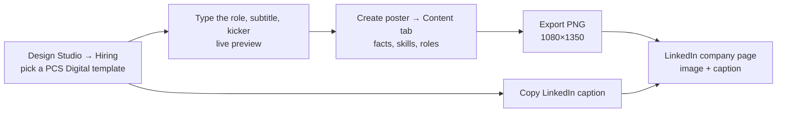

# PCS Digital: making posters and job posts

How to make PCS Digital's LinkedIn posters (job posts and festival wishes) in TECKSTUDIO's Design Studio, and how to post them.

The templates follow PCS Digital's own LinkedIn posts (October 2026):

- **Job posts** lead with the role. Next come work mode, engagement, joining and experience, then the required skills, and finally the details candidates must send with their resume.
- **Festival posts** are a white card with the logo on top, a coloured festival title, a navy message, and `contact@pcsdigitaltech.com` with `www.pcsdigitaltech.com` at the bottom.
- **Colours** follow the logo: blue for "PCS" and orange for "Digital".

## One-time setup (about 2 minutes)

1. Open **Dashboard → Design Studio** and pick any **PCS Digital** template. Search for "pcs" or use the **Hiring** filter.
2. In **My business details**, enter `PCS Digital`, a phone number if you want one on posts, and `Bangalore`. These are saved in this browser and filled into every new design.
3. After you create your first design, upload the logo once:
   1. Open the editor's **Uploads** panel and upload the logo.
   2. In the **Content** tab, under **Brand → Logo**, pick it.
   3. Click **Apply to page**.

   The logo replaces the "PCS Digital" text in the corner.

## A job post in three minutes

1. **Pick a template.**

   | When | Template |
   |---|---|
   | Urgent contract roles ("Immediate hiring", short notice) | **PCS Digital · Immediate hiring** |
   | One role with a skills list (like the Databricks post) | **PCS Digital · Role with skills** |
   | Several roles at once, e.g. a weekly round-up | **PCS Digital · Current openings** (up to 8 roles) |
   | Walk-in interviews | **Walk-in drive** |
   | Interns and freshers | **Internship** |
   | Asking employees to refer people | **Employee referral** |
   | Festival wishes | **PCS Digital · Festival wishes**, or any festival template with *My business details* filled in |

2. **Type the headline text** in the chooser: kicker (e.g. *Immediate hiring*), role and one subtitle line. The preview updates as you type.
3. **Pick the size.** Portrait 4:5 (1080×1350) takes up more of a phone screen in the feed than landscape, and is the default. Use LinkedIn 1200×627 if you want landscape.
4. **Click Copy LinkedIn caption.** It writes the post text in PCS Digital's usual structure:
   - 🚀/🚨 headline
   - 📍/💼/⏳ facts
   - ✅ skills
   - "📩 Please share these details with your resume"
   - the apply line
   - hashtags (#PCSDigital, #Hiring and the top skills)
5. **Click Create poster.** In the editor's **Content** tab, fill in the key facts (label + value + icon), skills and roles, then click **Apply to page**. Export a PNG from the editor.
6. **Post on LinkedIn from the PCS Digital page.**
   - Attach the PNG and paste the caption.
   - Edit the "please share" list if a role needs specific years, e.g. SAP IS-U or SVC2 experience.

> **Tip:** the poster holds what someone reads in two seconds (role, mode, experience, how to apply). The caption holds everything else. Don't put the full requirement list on the image; small text is unreadable on phones.

## Posting checklist

- [ ] Role, experience, location / work mode and engagement type are correct; CTC or rate only if you intend to publish it.
- [ ] The apply line names one channel (email or form) and it is monitored.
- [ ] The same role is also listed under the company page's **Jobs** tab, so it appears in LinkedIn job search. Mention it in the caption ("Apply via the Jobs tab").
- [ ] Alt text added on LinkedIn (e.g. "PCS Digital hiring poster: Databricks Engineer, remote, 5+ years").
- [ ] Ask team members to reshare in the first hour; reply to comments from candidates.
- [ ] Never ask candidates for a fee; say so on walk-in posters ("No fee").

## Several roles at once

- **One poster per role** works best for urgent hiring: each post gets its own reach and caption.
- **A round-up:** use **Current openings** for a weekly "we're hiring" post that lists every role.
- **Several images in one post:** export each job post as a PNG in the same size and attach them together to one LinkedIn post (multi-image). Readers swipe through the roles.

## Festival posts

- The Studio's **Coming up** row lists the next festivals, e.g. Diwali, Dussehra and Bathukamma in October.
- Use **PCS Digital · Festival wishes**, or any festival template, with *My business details* set to PCS Digital.
- **Download PNG** gives a finished image straight from the chooser, without opening the editor.
- **Copy LinkedIn caption** is available for job posts. For festival posts, use a caption in the PCS Digital style:

  > ✨ May the festival of lights bring wisdom, prosperity and new beginnings to you and your loved ones.
  >
  > 🌸 PCS Digital wishes everyone a very Happy Diwali!
  >
  > #HappyDiwali #PCSDigital

## What is not automatic yet

- **Posting:** the app does not post to LinkedIn. You upload the PNG and paste the caption.
- **Logo:** the real PCS Digital logo is not bundled. Upload it once, as described in the setup.
- **Skills and facts:** they are edited in the editor's Content tab, not in the chooser.
