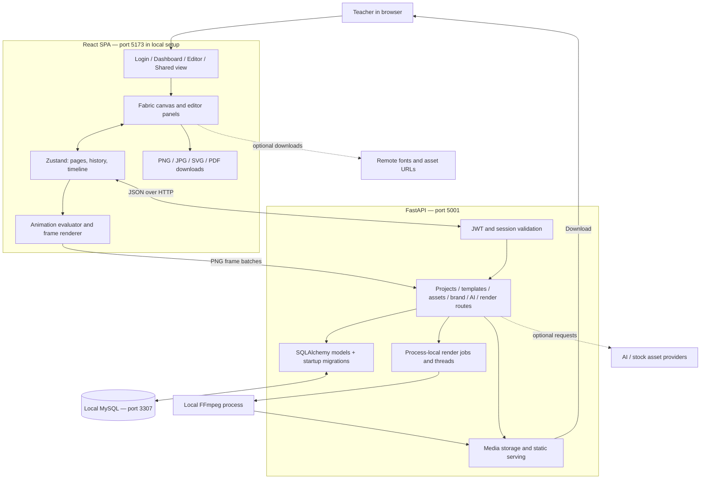
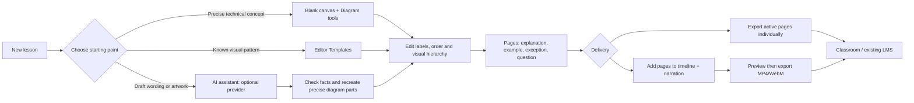
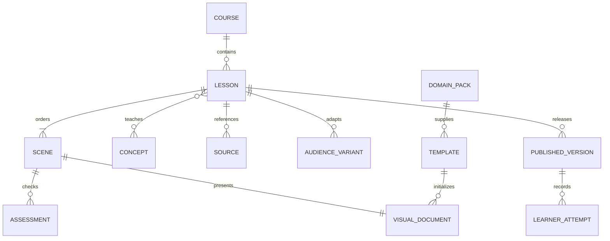

# Product deep dive and improvement plan

Reviewed September 6, 2026. Evidence comes from source inspection, local startup, build/lint checks and focused backend tests. This is a product and implementation review, not a full security audit. See [VALIDATION](VALIDATION.md) for the exact boundary of testing.

## Recommendation

Use TECKSTUDIO now as your **visual lesson authoring studio**. Its strongest fit is editable system diagrams, technical explainers, illustrated sequences and short narrated videos. Build a reusable lesson structure around these capabilities, then add a learner-facing layer. Avoid making AI-generated poster artwork the foundation for technical teaching: editable relationships, correct labels, worked examples and questions matter more.

Your first vertical should cover AI, software fundamentals, cloud, distributed systems and design systems. Keep the lesson model independent of these subjects so the same editor can later serve biology, engineering, business, mathematics and other fields.

## What is actually in the project

| Area | Implementation and evidence | Teaching implication |
|---|---|---|
| Authentication | JWT + bcrypt, persistent revocable sessions; [backend auth](../backend/auth.py), [routes](../backend/routes/auth.py) | Each teacher can own projects; no course/cohort roles yet |
| Dashboard | Projects, template browser, Brand Hub, shared items, trash and AI entry points; [Dashboard](../frontend/src/components/dashboard/Dashboard.tsx) | Good starting point for content; terminology is still creator/marketing oriented |
| Canvas editor | React 19 + Fabric 5, selection, layers, alignment, drawing, text, uploads; [Editor](../frontend/src/Editor.tsx) | Flexible visual authoring across subjects |
| Diagrams | Cards, anchors, connectors, routing, animated paths, stage tracker; [Diagram panel](../frontend/src/components/editor/ArchitectureDiagramPanel.tsx), [connector utilities](../frontend/src/utils/diagramConnectors.ts) | Particularly useful for requests, event flows, cloud boundaries and AI pipelines |
| Technical presets | AI Chat System Architecture, Distributed System Architecture, Technical AI Workflow Infographic, Prompt Context Harness Infographic; [Sidebar](../frontend/src/components/editor/Sidebar.tsx) | These are accessible from the editor's Templates panel, not just dashboard search |
| Reusable visual pieces | Technical cards, code/terminal panels, chips, nodes, chart parts and icons; [technical library](../frontend/src/utils/technicalReelDesign.ts), [infographic library](../frontend/src/utils/technicalInfographicDesign.ts) | A useful seed for domain-specific lesson kits |
| Pages and timeline | Pages, durations, transitions, object animation, audio tracks, recording UI; [timeline types](../frontend/src/types/timeline.ts), [Timeline panel](../frontend/src/components/editor/TimelinePanel.tsx) | Build sequences, reveals and narrated examples; not executable simulations |
| Technical Reel | Five specific AI-engineering scenes; [preset](../frontend/src/utils/technicalReelPreset.ts) | Reusable example, but not a generic lesson generator for any topic |
| Persistence | Fabric JSON plus `teckstudioPages`, `teckstudioTimeline` and active-page state inside a project; [store](../frontend/src/store/useEditorStore.ts) | Re-editable content; curriculum semantics are absent |
| Static export | PNG/JPG/SVG and active-canvas PDF; [export panel](../frontend/src/components/editor/EnhancedExportPanel.tsx) | Handouts and images are feasible; PDF is rasterized and not a native slide deck |
| Video export | Browser frame capture and multipart upload, backend jobs and FFmpeg; [export client](../frontend/src/services/videoExportService.ts), [routes](../backend/routes/video_render.py), [service](../backend/services/video_render_service.py) | MP4/WebM path exists; only 1080×1350 and 1080×1920 currently accepted |
| AI | Chat, image, poster/spec, thumbnail and remix routes, multiple providers; [AI routes](../backend/routes/ai.py) | Useful drafting aid; source-grounded instructional review remains manual |
| Editable numbered cards | `PosterSpec/v1` creates 3–9 cards and renders editable objects; [assistant](../frontend/src/components/editor/AIAssistant.tsx), [renderer](../frontend/src/utils/posterSpecRenderer.ts) | A strong starting point for cheat sheets; has an explicitly labeled local template fallback without a Gemini key |
| Images/OCR | Image upload checks, processing and editable import reconstruction; [uploads](../backend/services/upload_service.py), [OCR](../backend/services/ocr_service.py) | Can reuse diagrams/screenshots, but OCR and reconstructed positions need review |
| Sharing | Token record and public endpoint; current public page just links to owner-protected editor; [App](../frontend/src/App.tsx), [sharing routes](../backend/routes/shared.py) | Incomplete student consumption flow |
| Quality audit | Contrast, typography and alignment heuristics; [checker](../frontend/src/utils/designQualityChecker.ts) | Useful hints; does not verify subject accuracy or establish full accessibility compliance |

The original README understates technical/timeline features and overstates some readiness. It also gives Node 18 and a `/api/health` route, neither appropriate for this snapshot; the quick-start Node row and reviewed guides now correct those points. Component counts in older docs should not be treated as current.

## Architecture: current implementation



The canvas and timeline live primarily in the browser; the backend does not recreate an interactive browser scene on its own. “Backend video rendering” still depends on browser-generated frames. At 30 fps a 60-second lesson requires 1,800 frames, which explains memory, upload and temporary storage pressure. This is an arithmetic illustration, not a measured benchmark.

The local launcher is an additional development convenience: it owns a separate MySQL process and data directory, starts API and Vite, checks readiness and stops only its own children. It is not a production process supervisor.

## How content is saved

```mermaid
sequenceDiagram
    actor Teacher
    participant Canvas as Fabric canvas
    participant Store as Editor store
    participant API as Projects API
    participant DB as MySQL
    Teacher->>Canvas: Edit labels, objects or pages
    Canvas->>Store: Save history and synchronize active page
    Store->>Store: Serialize objects, custom metadata, pages and timeline
    Store->>API: PUT project with JSON string
    API->>API: Confirm project belongs to user
    API->>DB: Update project; create/coalesce Autosave version
    DB-->>API: Commit
    API-->>Store: Updated project timestamp
    Teacher->>Store: Reopen project
    Store->>API: GET project
    API-->>Store: Saved JSON
    Store->>Canvas: Load objects and editor metadata
```

Important reliability gaps: `saveHistory` can issue overlapping writes, does not surface a failed HTTP response clearly, and can leave older save requests racing newer ones. `AutoSaveIndicator` has an error display but no failure event sets it in the normal store path. Undo/redo restores local state without an immediate corresponding project save. These are code-level risks; data loss was not deliberately reproduced against user content.

A backend `DesignVersion` table exists, but the inspected projects API has no general list/get/restore version endpoints. The editor History panel should not be described as a durable restore workflow. The current coalescing timestamp moves on each save, so continuous edits can remain in one Autosave snapshot until there is a long enough pause.

## Teaching flows



A diagram can show the state of a distributed system at successive times, but dragging a node or playing an animation does not run a consensus algorithm. Distinguish explanatory animation from an executable simulation when teaching.

## Prioritized improvements

Priorities reflect the stated goal: reliable teacher authoring and clear student consumption. Effort is relative to the current code, not a delivery commitment.

| Priority | Improvement | Why it matters / concrete evidence | Completion test | Effort |
|---|---|---|---|---|
| P0 | Serialize saves, debounce writes, show errors, retry, save undo/redo | Store currently logs exceptions and allows overlapping PUTs | Delay and fail requests; newest edit survives reload and “saved” only appears after commit | Medium |
| P0 | Read-only learner view | `/view/:token` has no renderer; `/editor/:id` requires login and ownership | Open token as unauthenticated learner; navigate pages/play video without gaining edit access | Medium |
| P0 | Sharing and uploaded-media access rules | `access_level` is a free string; token endpoint does not enforce private visibility; `/media` static mount bypasses auth | Private/revoked assets inaccessible, view cannot edit, edit requires explicit ACL; test two users | Medium–large |
| P0 | Reproducible startup and meaningful smoke checks | Original setup lacked a complete local path and depended on unbounded Python versions | Clean machine start, persistence round trip, FFmpeg encoding, restart with same data | Small–medium; partly done here |
| P1 | Lesson metadata and authoring wizard | Current model stores presentation JSON, not outcomes/audience/prerequisites | Teacher creates a five-scene lesson with outcome, source notes and practice prompt | Medium |
| P1 | Reusable lesson/domain packs | Subject-specific code is spread among large rendering functions | Add a new biology or finance pack by validated data files without editor changes | Medium |
| P1 | Landscape video and full lesson export | Backend rejects 16:9; static PDF exports current canvas only | 1920×1080 and portrait export preserve layout; one PDF includes all intended pages in order | Medium |
| P1 | Provider/model maintenance and honest AI status | Retired Gemini defaults; mixed local fallback and provider behaviors | Health distinguishes configured/available; no silent fake success; smoke each supported provider | Medium |
| P1 | Grounded educational generation | No instructional source/citation model or factual validation | Generated lesson carries references and explicit review status; teacher approves before delivery | Medium–large |
| P1 | Accessible learner output | Canvas objects are not a semantic lesson; audit is visual heuristics | Keyboard navigation, transcript, readable text alternative, caption file and reduced motion | Medium |
| P2 | Durable render worker and bounded queues | Process-local threads/status cannot reliably recover across server restarts | Restart API during encoding; job recovers or clearly fails; per-user limits prevent overload | Medium–large |
| P2 | Performance and editor modularity | Main bundle about 2.21 MB minified / 561 KB gzip in this build; store 2,526 lines, ElementsPanel 3,744 | Split editor from dashboard; lazy-load specialist tools; benchmark editing and memory | Medium |
| P2 | Media portability and complete backups | Browser-local URLs, remote fonts/assets, separate disk/DB state complicate portability | Export package opens after reload on another machine with all licensed assets present | Medium |
| P2 | Courses, cohorts, practice and progress | No learner/session/assessment data model found | Instructor assigns lesson, learners submit responses, instructor reviews progress | Large |

Before exposing this development app beyond localhost, resolve the access issues, endpoint abuse controls, file-delivery authorization, secret configuration and operational monitoring. These follow from specific code paths; no public deployment is included in this work.

## Proposed domain-independent model

Keep curriculum semantics separate from Fabric coordinates. This gives a lesson a stable identity even if a teacher changes the visual layout.



**Proposed, not implemented:** a `Lesson` contains title, domain, audience level, prerequisites, observable objectives, ordered scene IDs, sources and review status. A `Scene` contains its purpose, explanation, visual document/page reference, narration/transcript, duration, alt description and optional question. A question contains the prompt, answer/rubric and feedback. Keep answers out of unauthenticated client bundles when scoring matters.

Each `VisualDocument` can initially reference the current Project ID plus stable Page ID and schema version. Do not immediately rewrite the rendering engine. Add migration/validation at the JSON boundary, then gradually separate editor persistence, playback state and lesson content.

Domain packs provide vocabulary, icon sets, scene patterns, common misconceptions, sources and example activities. AI, software, cloud and design systems use the same core primitives: entity, relationship, sequence, comparison, state change, evidence and question. Biology changes “service” to “organ”, and business changes “request” to “order”; the lesson model remains usable. Domain packs should describe semantics and constraints, not merely recolor a generic poster.

## Suggested implementation sequence

1. **Make classroom work dependable.** Complete save/reload reliability, read-only viewing and file access rules. Keep the local setup and smoke checks working.
2. **Ship one complete lesson template.** Outcome → mechanism → worked example → failure/misconception → practice/recap. Add authoring metadata and multi-page PDF/landscape video.
3. **Generalize into five technical packs.** Build AI, software, cloud, distributed systems and design systems packs from validated content data. Prove reuse with one nontechnical pack.
4. **Add grounded AI assistance.** Generate a structured lesson draft from teacher-supplied sources and a schema; keep teacher review explicit. Track provider, model, sources and generation errors.
5. **Add student interactivity.** Learner player, questions and feedback first; progress tracking and LMS integrations after content delivery is stable.

A useful product acceptance exercise is to ask one teacher to create a beginner HTTP lesson, adapt it for a graduate and a professional, export it, reopen it, and give it to another person without explaining the editor. Measure time to first lesson, successful reload/export, learner completion and answer quality. Targets should be set after a baseline; none were measured in this review.

## External compatibility references

- [Vite prerequisites](https://vite.dev/guide/): verifies Node requirements; local Node 24 satisfies them.
- [MySQL initialization](https://dev.mysql.com/doc/refman/8.4/en/data-directory-initialization.html): explains isolated data-directory initialization.
- [Google model lifecycle](https://ai.google.dev/gemini-api/docs/deprecations): verifies retirement of the inherited Gemini 2.0 model.
- [Google SDK guidance](https://ai.google.dev/gemini-api/docs/libraries): informs legacy-client migration planning.

Provider recommendations above reflect documentation checked September 6, 2026. Live provider behavior, account access and billing were not tested.
