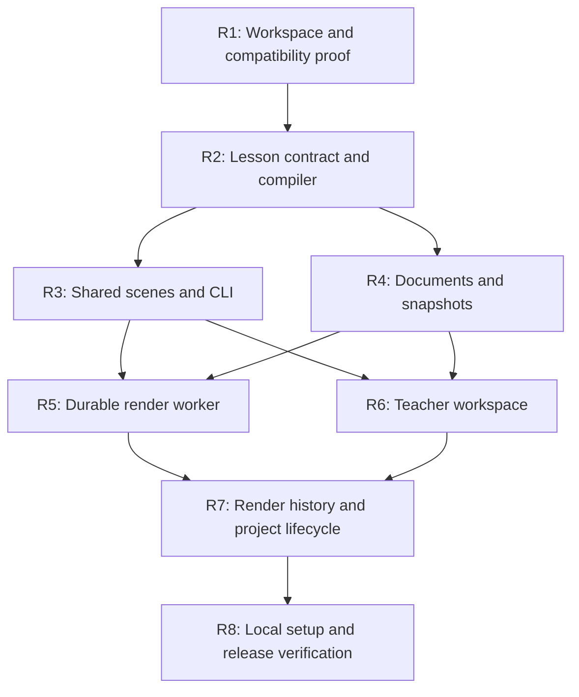
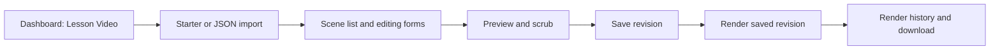

# Remotion: implementation work plan

Prepared and implemented September 11, 2026. Status: **M0–M2 runtime implemented and locally verified**. Use the [local usage guide](REMOTION_LOCAL_GUIDE.md) for current commands and the [validation record](REMOTION_VALIDATION.md) for measured evidence and remaining coverage gaps.

The work packages below retain their original acceptance targets as a design record. The checklist tracks implementation; it does not claim every proposed test was run. In particular, a real browser UI walkthrough and Linux/Windows validation remain unverified.

This is the execution companion to the [integration design](REMOTION_INTEGRATION_PLAN.md). It turns milestones M0–M2 into bounded changes with dependencies, file ownership and observable completion criteria. M3–M4 remain follow-on work.

## Release outcome

A teacher can create a **Lesson Video**, import the [API request fixture](examples/lesson-video-api-request.json), edit its scenes, save, preview, render locally and download an MP4. A developer can render the same JSON from a CLI without accounts or a database. Submitted platform jobs survive closing the editor and recover after a worker restart.

The acceptance example is five scenes, 1,620 frames, 54 seconds, 1920×1080 at 30 fps. The first release supports title, diagram walkthrough, question/reveal and recap scenes. It uses hard cuts, packaged fonts and silent video. Narration, captions, additional formats, AI drafting and canvas-image import follow after this complete path works.

### Decisions for the first release

| Area | Implementation decision |
|---|---|
| Integration | Add a protected, lazy-loaded `/lesson-video/:projectId` route and a dashboard entry. |
| Shared packages | `packages/lesson-video` owns validation and frame/layout compilation; `packages/video-scenes` owns React scenes. |
| Package manager | Keep npm; adopt a root workspace and lockfile, preserving resolved existing dependencies where possible. |
| Rendering | Local Node renderer; one active job initially. Remotion packages pinned together at 4.0.523. |
| Persistence | One lesson document per project; separate immutable render snapshots. Preserve existing Fabric `Project.data`. |
| API authority | FastAPI owns authentication, ownership, persistence and queue transitions. Worker claims jobs through an internal API. |
| Output | H.264 MP4, poster image and reproduction manifest. Caption/transcript output follows narration support. |
| Initial input limits | 1 MiB JSON, 1–30 scenes, 30 fps, up to 10 minutes; diagram scenes up to 6 nodes, 10 edges and 12 reveal steps. Node/edge labels are capped at 32 characters. Dense graphs still need review; these are not performance promises. |
| Unsupported inputs | Return explicit validation errors for unsupported scene types, output presets, external assets, narration or transitions. Do not silently discard fields. |
| Scope of editing | Forms for scene content and diagram steps, ordering, durations, duplicate/delete, JSON import/export. Free-position canvas editing is later. |

## Dependency order



Implement these as reviewable patches in the listed order. The arrows describe code dependencies, not a requirement to use multiple agents. Each patch should leave existing product functions buildable. Enable the new dashboard entry once the workspace and job path work together.

## R1 — Workspace and compatibility proof

**Changes**

- Add root `package.json` with workspaces for `frontend`, `renderer` and `packages/*`; migrate lockfile ownership deliberately.
- Add `renderer/package.json`, a composition entry and a minimal five-second scene. Pin Remotion packages together; verify the installed React/TypeScript combination.
- Establish explicit package exports: browser-safe schema/scenes versus Node-only bundler/renderer code. Use React/Remotion peer dependencies in shared scene packages.
- Add a temporary development preview or component harness to exercise the exact shared component in Player.
- Update workspace-sensitive invocations in [setup_local.sh](../scripts/setup_local.sh) and [local_stack.py](../scripts/local_stack.py). The launcher currently assumes `frontend/node_modules/vite/bin/vite.js`; workspace hoisting makes that assumption unsafe. Use npm workspace scripts with the frontend working directory preserved for `.env.local` loading.

**Done when:** existing frontend production build succeeds; the shared component previews and renders locally; MP4 metadata and representative frames are checked; browser version and exact package versions are recorded. Record the license applying to the selected release using the official source linked in the integration design.

**Recovery:** keep copies of original package manifests/lockfiles before migration. If compatibility fails, resolve it here before changing database or product routes.

## R2 — Lesson contract and deterministic compiler

**Add** `packages/lesson-video/{schema,src,fixtures}` with a versioned JSON Schema, TypeScript types, validator, compiler and the canonical example. Keep the documented fixture synchronized from one source.

The compiler returns dimensions, fps, total frames, scene start/end frames, resolved diagram positions, edge routes and reveal states. Node IDs are scoped to a scene; scene IDs are unique across a lesson. Returning and outgoing diagram edges need separate routes so labels and arrowheads do not overlap.

Use scene-local integer frames and exclusive ends. A step describes a complete highlight/state selection at its timestamp; it does not depend on which previous frames were played. Validate reference integrity, sorted unique step times, question reveal times, supported states and cumulative duration. Derive visual motion only from the requested frame.

Use the same versioned schema and shared valid/invalid fixtures for backend structural validation. Keep any duplicated semantic validation rules small and check parity explicitly. Resolve defaults before hashing so preview and rendering agree.

**Done when:** the example resolves to exactly 1,620 frames; scene boundaries are `0, 180, 600, 1050, 1350, 1620`; unknown fields/types, broken graph references, unsupported options and invalid timing fail with a useful field path. Tests cover frame 0, each boundary and frame 1619, including out-of-order evaluation.

## R3 — Shared scenes and local CLI

**Add** `packages/video-scenes/src/` components for the four scene types and the lesson composition. Add packaged fonts and their license files. Keep template assets local and avoid dependence on the editor's store, stylesheets, fonts or network state.

**Add** `renderer/src/{Root.tsx,render-cli.ts,render-lesson.ts}`. Register the stable composition ID `LessonVideo`. Use the shared compiler for metadata. Bundle once per source/dependency identity and pass identical input props to composition selection and rendering. Require an explicit output path; reject an existing output unless an explicit overwrite flag is supplied.

Implemented interface:

```bash
npm run video:render -- --spec docs/examples/lesson-video-api-request.json --out .local/exports/api-request.mp4
npm run video:studio
```

Create MP4, a useful poster frame, and a manifest containing input/template/bundle/font hashes and renderer/browser versions. File names should derive from a safe output stem, not arbitrary titles embedded in the spec.

**Done when:** the whole 54-second example renders and can be inspected, the question reveals at its intended time, diagram states are legible, no frame requires the live editor, and the same local inputs render with network access disabled after setup. Probe dimensions, duration and video codec. Test repeated frame selection, missing fonts, invalid output paths and interrupted rendering.

## R4 — Lesson documents, snapshots and API contracts

**Modify** [database.py](../backend/database.py), add versioned migrations under `backend/migrations/`, register routes in [main.py](../backend/main.py), and add `backend/{routes,schemas,services}/lesson_video.py` as appropriate. Use the existing [migration runner](../backend/migrate.py); migrations must support existing databases as well as fresh initialization.

**Models**

- `LessonVideoDocument`: ID, unique project ID, schema version, draft JSON, integer revision and timestamps.
- `LessonVideoSnapshot`: ID, project/document references, draft revision, immutable normalized spec, template/bundle identity, asset manifest, resolved plan and hashes. The implementation seals the deterministic plan at API submission; the worker recompiles and compares it before publishing completion.
- Extend `VideoRenderJob`: snapshot reference, idempotency key, attempt, lease token/expiry and heartbeat. Add queue lookup and idempotency indexes. Existing rows retain their legacy mode and valid defaults.

**Public contracts**

| Operation | Proposed request/response behavior |
|---|---|
| Create | `POST /api/lesson-videos` creates an owned project with `design_type: lesson-video` and its initial document in one transaction. Accept a supported starter or validated spec. |
| Load | `GET /api/projects/{id}/lesson-video` returns document, spec and revision. |
| Save | `PUT /api/projects/{id}/lesson-video` accepts `{expected_revision, spec}`. First document revision is 1; successful saves increment it. A stale revision returns 409 without overwriting either draft. |
| Submit | `POST /api/video/render/remotion` accepts `{project_id, expected_revision, idempotency_key}`. Render the saved revision, never unvalidated browser-generated props. Return 202 with job ID and snapshot identity. |
| History | `GET /api/projects/{id}/video-renders` returns owned jobs newest-first with bounded pagination. Filter by engine when requested. |
| Status/cancel/download | Extend existing routes and schemas while retaining their current response fields and status values. |

Creation and job submission are separate transactions. Submission atomically writes the immutable snapshot and queued job. A duplicate key with identical inputs returns the original job; a different payload using that key returns 409. A database unique constraint enforces this under concurrent requests.

Use server-side ownership checks on every public operation, including history, snapshots and artifacts. Reject unsupported spec versions before creating jobs. A worker-unavailable response or visible queued state should explain that local rendering needs the worker; never fabricate progress.

**Done when:** save/reload works, competing saves produce a conflict, job inputs stay unchanged after draft edits, duplicate submissions behave correctly, and another account cannot inspect or alter the lesson or its jobs. Check migration re-runs and upgrade a disposable copy of the existing MySQL schema.

## R5 — Durable queue and local worker

**Add** `renderer/src/{worker.ts,render-child.ts}` and backend queue services/internal routes. The worker is a supervised process that talks to FastAPI with a private worker credential. It needs neither public exposure nor database credentials.

Use a transaction and row locking to claim one eligible Remotion job atomically. Set an attempt-specific lease token and expiry using the server clock. The worker heartbeats while its render child works, updates progress and reads cancellation. Treat a missing job, failed lease renewal or mismatched token as loss of authority and stop that attempt.

Proposed operating defaults: 2-second idle poll, 10-second heartbeat, 60-second lease, at most two attempts for transient worker failures. These are configurable starting values. Validation failures are terminal; cancellation never retries. Use a bounded render timeout and enforce it on the child process.

Keep `queued → processing → completed/failed/cancelled` externally. Preparation, frame rendering and encoding are stages. For expired leases, atomically requeue when an attempt remains, otherwise mark failed. Every progress/completion update checks job mode, status, attempt, lease and cancellation flag.

Write each attempt into its own directory. The API computes allowed output locations from the job and attempt IDs and verifies the output before publishing completion; it must not trust a worker-supplied arbitrary path. Cancellation that wins the state transition prevents a late completion. Retry uses the same sealed inputs and retained bundle, not the currently edited template.

**Done when:** jobs continue after a tab closes, restart recovers a killed worker's job, a stale attempt cannot publish, cancellation stops rendering, and interrupted files never appear as completed outputs. Test queue contention and row-lock behavior against local MySQL, since fake sessions cannot establish these guarantees.

## R6 — Teacher workspace

**Modify** [App.tsx](../frontend/src/App.tsx) and [Dashboard.tsx](../frontend/src/components/dashboard/Dashboard.tsx); add `frontend/src/features/lesson-video/` and a small typed service using [apiClient.ts](../frontend/src/services/apiClient.ts).



Provide scene selection, reordering, duplicate/delete, text edits, diagram nodes/edges/steps, duration editing and a total-duration display. Start with an explicit Save action and a dirty-state indicator. On a stale-revision conflict, keep the local draft and offer reload/export of local edits; do not silently choose a winner.

The Player uses the same scene components and compiled metadata as the renderer. JSON import validates before replacing a draft, reports errors by field, and preserves the prior valid draft on failure. Render saves pending edits, waits for the resulting revision, then submits once with a stable idempotency key. Editing during rendering affects only the draft.

The dashboard currently opens all projects through `/editor/:id`; extend project metadata and navigation so Lesson Video projects reopen in the correct workspace. Include loading/error states for the lazy route, keyboard-accessible controls and a clear unsupported-input message.

**Done when:** a teacher can complete the entire workflow from the dashboard without developer tools; reopening restores the saved lesson; the preview seeks correctly; a failed save blocks submission of unintended content; the original canvas workspace still opens normally.

## R7 — Render history, downloads and project lifecycle

This task closes integration gaps that a standalone render demo would miss.

| Existing behavior | Required change |
|---|---|
| [Download route](../backend/routes/video_render.py) accepts paths only under the legacy `RENDER_ROOT` | Choose and validate the allowed root by job mode. Add owned access to poster and manifest artifacts. Use authenticated fetch/download in the frontend. |
| [Cancellation service](../backend/services/video_render_service.py) relies on an in-memory subprocess map | Dispatch Remotion cancellation through the persisted job/lease protocol. Preserve legacy cancellation behavior. |
| [Expiry cleanup](../backend/services/video_render_service.py) queries completed jobs across modes | Limit legacy cleanup to its engines; implement explicit retention for Remotion scratch and published artifacts. Never clean active attempts. |
| [Trash metadata](../backend/routes/projects.py) serializes existing project fields | Include the lesson document in trash metadata and reconstruct it on restore. Restored projects must return to the lesson workspace. |
| Project deletion cascades related records | Reject moving a lesson project to trash while a render is active, with a clear cancel-first message. Guard deletion/submission with the same project lock. A worker stops if its job disappears. |

For this first release, trash/restore guarantees restoration of the editable lesson draft. Explain that render history and generated artifacts are not restored; they can be regenerated. Remove associated output files through deferred cleanup after the deletion transaction commits, and make permanent-trash deletion consistent with this policy.

Render history shows the rendered revision, status/stage, progress, completion time, error and authorized downloads. Poll only active jobs; stop polling when navigating away and resume by loading history on return. Include a worker-offline indicator backed by heartbeat health.

**Done when:** a completed MP4 downloads through the real authenticated UI; cross-user downloads fail; terminal-job cleanup is engine-specific; save → trash → restore preserves the lesson; active-render deletion cannot race with submission. No legacy artifact is affected by a Remotion cleanup path.

## R8 — Local setup, operation and release verification

**Modify** [setup_local.sh](../scripts/setup_local.sh), [local_stack.py](../scripts/local_stack.py), backend configuration examples, `.gitignore`, and the [local setup guide](LOCAL_SETUP.md). Add a dedicated lesson-video smoke script.

- Setup installs workspace dependencies and prepares the headless browser, default fonts, build bundle and output directories. Expose download failures clearly.
- Generate a dedicated private worker credential for the managed local stack, preserving existing credentials and data. Do not place it in frontend environment variables or browser-visible props.
- Start MySQL, API, frontend and renderer with one existing launcher command. Verify worker registration/heartbeat before reporting readiness; expose its log path.
- Stop in reverse dependency order. Gracefully stop the worker and its render child/browser processes, then API/database. An interrupted render becomes eligible for restart recovery after lease expiry; shutdown must not imply successful completion.
- Keep versioned bundles in `.local/video-bundles/`, ephemeral child inputs in `.local/`, and platform attempts/outputs in `.local/video-artifacts/`. Cache rebuilds must not remove a bundle referenced by a retryable snapshot.
- Show whether the worker is online and render capability is available. Avoid requiring an AI account or cloud credentials for the starter lesson.

**Release verification**

| Scenario | Required evidence |
|---|---|
| Existing application | Frontend build, applicable lint, focused auth/project/upload/render checks and legacy MP4 smoke pass. Record existing warnings separately. |
| CLI | Full sample MP4 is 1,620 frames at 30 fps and 1920×1080; selected frames inspected; poster and manifest exist. |
| Platform | Create/import, edit, save, reload, preview, submit, reconnect and authenticated download succeed. |
| Recovery | Stop/restart worker during rendering; one attempt publishes completion and stale updates are rejected. |
| Authorization/concurrency | Cross-account reads/downloads denied; duplicate submissions, conflicting saves, cancellation races and deletion races handled. |
| Persistence | Lesson survives launcher restart and trash/restore; editing after submission does not alter the render snapshot. |
| Local operation | Subsequent render works offline with installed dependencies/assets; stop leaves no owned render process running. |
| Resource baseline | Record render time, peak memory, artifact size and machine/runtime versions. Establish limits from observation. |

Update the visual guide to distinguish implemented behavior from the M3–M4 roadmap, and replace proposed CLI commands with verified ones. Do not mark the release complete based solely on compilation or a mocked render result.

## Delivery checklist

- [x] R1: Workspace and compatibility proof
- [x] R2: Shared contract and compiler
- [x] R3: Scene library and full local CLI render
- [x] R4: Versioned documents, snapshots and owned APIs
- [x] R5: Durable worker, recovery and cancellation
- [x] R6: Teacher workspace and correct project navigation
- [x] R7: Render history, authenticated downloads and trash/restore
- [x] R8: One-command local stack and release verification

R1–R8 are implemented. The native 54-second CLI and platform renders, MySQL concurrency check, interruption recovery, focused regression tests and local restart were exercised. See [validation](REMOTION_VALIDATION.md) for exact coverage and the single-run resource observation. M3 (narration, captions and additional formats) and M4 (domain packs, AI drafting and batches) remain next milestones.
