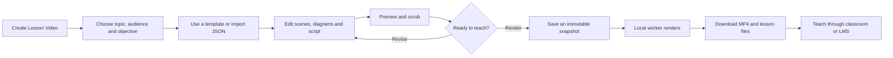
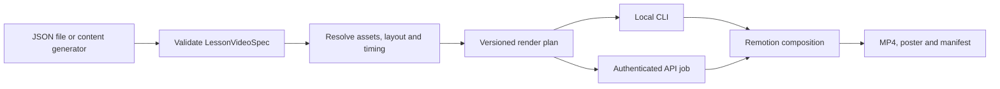
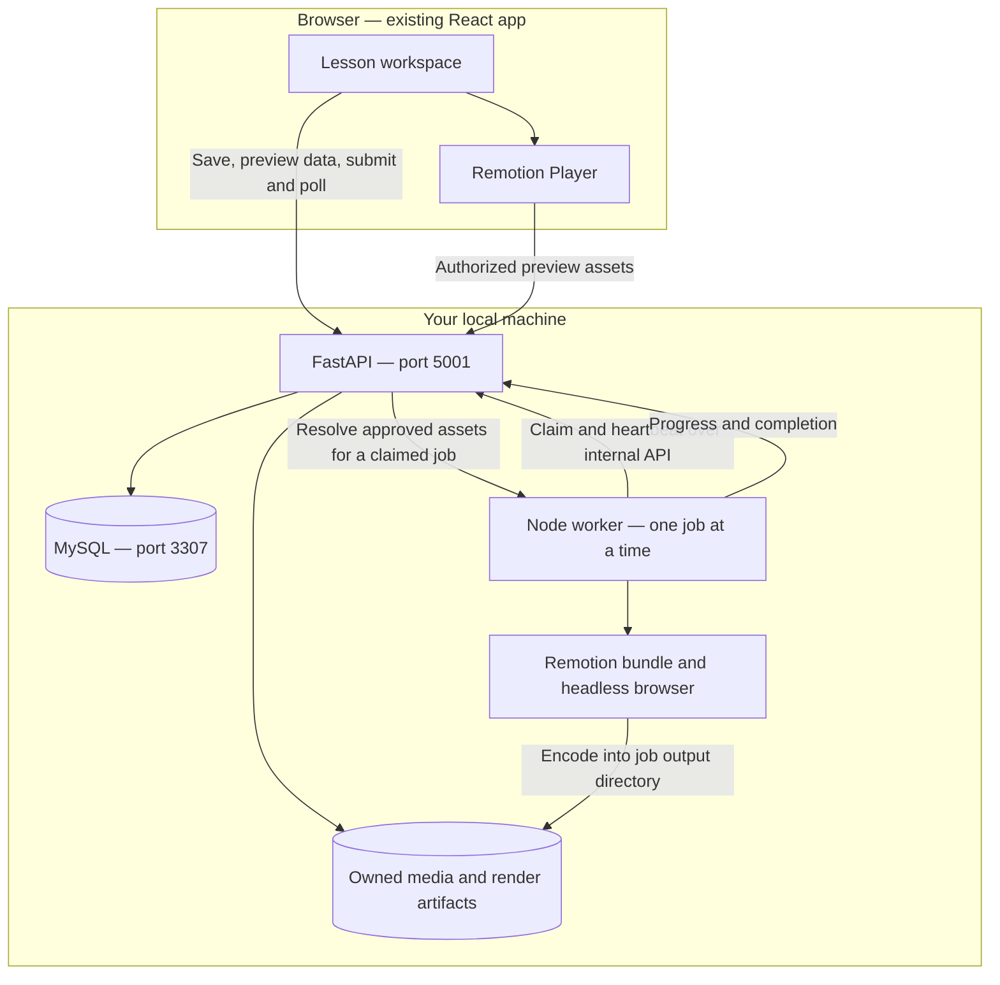
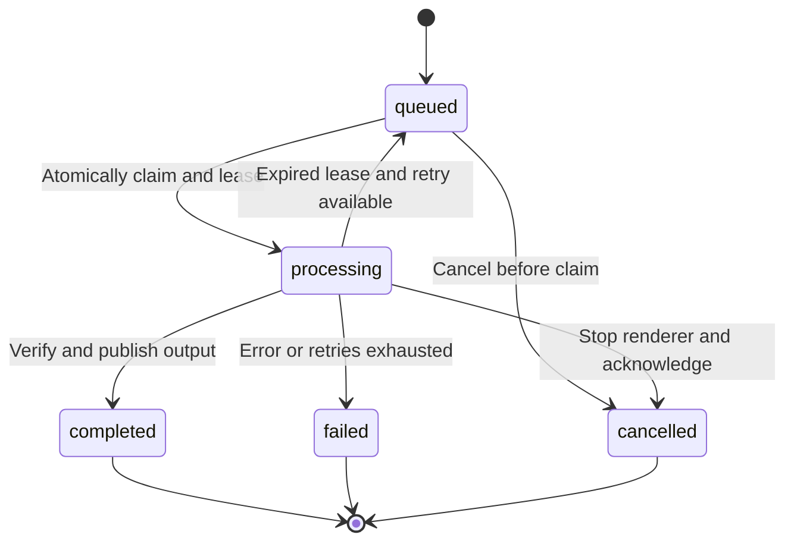

# Remotion integration plan for TECKSTUDIO

Status: **M0–M2 implemented September 11, 2026; M3–M4 remain planned**. This document retains the original integration design and future targets. The application now imports the example, previews it and renders it locally. Use the [current usage guide](REMOTION_LOCAL_GUIDE.md) and [validation record](REMOTION_VALIDATION.md) for actual behavior and tested limits.

For the concrete change sequence, file map, API contracts and release checklist, see the [implementation work plan](REMOTION_IMPLEMENTATION_PLAN.md).

## Recommended direction

Add a **Lesson Video** workspace that turns structured content into animated explanations. Use shared React scene components for in-app preview and a local Node worker for MP4 rendering. Keep FastAPI responsible for accounts, project ownership, assets and render jobs.

Start with new lessons created from JSON or a structured form. Add AI-assisted drafting after the content contract and renderer work. This order gives us a repeatable programmatic path before introducing generated-content variability. Existing Fabric projects continue to use their current export path, with a page-image import bridge as a separate milestone.

The first release should work on your Mac using the existing local stack plus one Node worker. Cloud rendering is an optional later deployment choice. Remotion supplies rendering and playback tools; lesson planning, factual review, narration generation and learner assessment remain platform responsibilities.

## 1. What already exists and where Remotion fits

| Existing capability | Evidence in this repository | Integration decision |
|---|---|---|
| React 19, Vite, TypeScript frontend | [frontend/package.json](../frontend/package.json) | Embed Remotion Player in a lazy-loaded lesson workspace. Keep Node renderer dependencies out of the browser bundle. |
| Fabric pages, clips, transitions and audio tracks | [timeline types](../frontend/src/types/timeline.ts), [timeline serialization](../frontend/src/utils/timelineExport.ts) | Preserve this project format. Introduce a separate semantic lesson format. |
| Browser prepares and uploads export frames | [VideoExportDialog](../frontend/src/components/editor/export/VideoExportDialog.tsx), [videoExportService](../frontend/src/services/videoExportService.ts) | New Remotion jobs submit a saved spec and assets once; the worker prepares frames. |
| Authenticated create/status/cancel/download routes | [video routes](../backend/routes/video_render.py) | Add a Remotion submission route and reuse ownership rules and job status conventions. |
| SQL render-job records, background rendering threads | [VideoRenderJob](../backend/database.py), [render service](../backend/services/video_render_service.py) | Extend the model with immutable input snapshots and worker leases. Existing threads alone do not provide restart recovery. |
| Export dimensions restricted to 1080×1350 and 1080×1920 | [render validation](../backend/services/video_render_service.py), [route validation](../backend/routes/video_render.py) | Add 1920×1080 for the new engine through engine-specific validation. Review both frontend and API limits. |
| Frame-time animation calculations | [animationEvaluator](../frontend/src/utils/animationEvaluator.ts) | Evaluate reuse of pure timing/easing helpers. Full [scene renderer](../frontend/src/utils/sceneTimelineRenderer.ts) depends on Fabric and editor-specific behavior. |
| Recorder stores a browser object URL | [VoiceRecorderModal](../frontend/src/components/editor/timeline/VoiceRecorderModal.tsx) | Persist recordings as owned assets before a worker can render them. A `blob:` URL is not durable. |
| Local MySQL/API/frontend supervision | [local_stack.py](../scripts/local_stack.py), [setup script](../scripts/setup_local.sh) | Extend the launcher to prepare and supervise the Node worker. |

Remotion Player embeds a parameterized React video in the existing app. Its Node renderer supports the bundle → select composition → render workflow, so this project does not need a Next.js rewrite. [Player documentation](https://www.remotion.dev/docs/player), [Node rendering documentation](https://www.remotion.dev/docs/ssr-node).

## 2. Proposed user flows

### Teacher: create, review, render



Proposed screen: scene list on the left, Player in the center, content and narration controls on the right, timing below. Show a clear render-history panel with progress, cancellation, errors and downloads. Reopening the workspace recovers job status. Editing after submission creates a new draft revision without changing the running job.

In the first workspace, users edit structured fields, diagram nodes, connections and reveal steps. Arbitrary Fabric-style object dragging is a later feature. Remotion Studio remains a developer tool for building templates; it is not the teacher-facing application.

### Programmatic: one spec, many lessons



The CLI should accept the same lesson spec as the platform. A later batch wrapper expands explicit variants such as audience, language or aspect ratio into separate specs and jobs. It should record each variant's success or failure, resume incomplete work and avoid resubmitting successful jobs.

AI drafting is an optional source of validated JSON. It must select implemented scene types and return editable content with source notes. Generated JavaScript, TSX and arbitrary executable templates are outside this content contract.

## 3. Local architecture



Use the existing MySQL database as the initial durable queue. The worker polls protected internal endpoints; FastAPI atomically claims a queued job, creates a lease and remains the only database authority. The worker does not need a publicly reachable listener or direct database credentials. Start with one job and conservative frame concurrency; benchmark memory and render time before raising either.

The Node path is `bundle()` → `selectComposition()` → `renderMedia()`. Cache the bundle by source/dependency hash; pass the same JSON-serializable input props to selection and rendering. The worker owns browser execution and encoding, so a submitted job can finish after the author closes the tab, while local services remain running. This is not a guarantee that rendering is faster than the current exporter. [Official Node rendering example](https://www.remotion.dev/docs/ssr-node).

### Shared code boundary

Proposed layout; these packages do not exist yet:

```text
packages/
  lesson-video/        # JSON schema, TS types, validator, timing/layout compiler
  video-scenes/        # React components; browser-safe; no editor store imports
renderer/
  src/Root.tsx         # Remotion composition registration
  src/worker.ts        # claim, prepare, render, heartbeat, cancel, complete
  src/render-cli.ts    # render a JSON file without the platform database
  public/             # checked-in fonts and template assets
frontend/src/features/lesson-video/
  LessonVideoEditor.tsx
  LessonPreview.tsx
  RenderHistory.tsx
backend/
  routes/lesson_video.py
  services/lesson_video_service.py
  migrations/         # versioned schema and render-job extensions
```

The implementation uses npm workspaces and one root `package-lock.json` for shared React/Remotion versions. The former frontend lockfile was migrated and setup/build commands updated. Shared scene packages use peer dependencies for React and Remotion so the Player and worker do not load duplicate runtimes.

Dependency roles: `remotion` and `@remotion/player` for preview; `@remotion/renderer`, `@remotion/bundler` and `@remotion/cli` for the Node/dev environment; add transitions and captions packages when those milestones need them. The installed Remotion packages are pinned together at 4.0.523. [Version compatibility guidance](https://www.remotion.dev/docs/version-mismatch).

## 4. Content contract: LessonVideoSpec v1

Separate **what to teach**, **how to present it**, and **the resolved render inputs**. Domain terms belong in content packs; rendering primitives should work across disciplines.

| Layer | Proposed fields | Responsibility |
|---|---|---|
| Learning content | ID, title, domain, audience, locale, objectives, prerequisites, source notes | Explain the intended learner outcome and factual basis. |
| Presentation | Template ID/version, theme, output preset, scenes, diagram steps, script | Describe editable visual intent using supported types. |
| Resolved render plan | Frame ranges, layout coordinates, caption cues, asset manifest, output metadata | Freeze complete inputs before rendering. No content generation during frame evaluation. |
| Reproduction manifest | Spec/snapshot hash, template and bundle hashes, renderer/browser versions, font/media hashes, random seed | Recreate the same lesson and investigate differences; do not promise byte-identical encoding across machines. |

Use JSON Schema as the language-neutral contract, with a TypeScript validator/compiler and server-side validation against the same versioned schema. Validate semantic rules too: referenced node IDs exist, timestamps fit their scenes, content fits template limits and assets are owned. Share valid/invalid fixtures across Python and TypeScript checks.

### First scene primitives

| Scene | Content | Teaching use |
|---|---|---|
| Title/outcome | Heading, short subtitle, objective | Establish the question and expected understanding. |
| Diagram walkthrough | Nodes, labeled edges, timed highlights and states | Request flows, AI pipelines, cloud architecture, biological pathways. |
| Code walkthrough | Language, code, annotated lines, explicit trace steps | Software examples; display only, no code execution. |
| Comparison | Named alternatives, criteria and consequences | Architecture tradeoffs, design systems, competing explanations. |
| Question/reveal | Prompt, answer, explanation and reveal time | Pause-and-predict practice; an MP4 does not collect or grade answers. |
| Recap | Key points and a next task | Reinforce the objective and lead into a practical exercise. |

Build title, diagram, question and recap first. Add code and comparison after one complete lesson renders reliably. Add specialized charts, equations, timelines and spatial views through explicit scene types with their own fixtures.

The companion [API request example](examples/lesson-video-api-request.json) proposes a **54-second, 30 fps, 1920×1080** lesson with five scenes: outcome (6s), successful request (14s), failed dependency (15s), question/reveal (10s), recap (9s). It uses hard cuts, deterministic diagram reveals and no external assets or narration. It is the initial implementation acceptance fixture, not an already-rendered video.

### Timing and preview rules

Store new scene durations and step times as integer frames. Scene intervals use an exclusive end. At 30 fps, frame 90 is 3 seconds. The compiler is the single owner of total duration, scene placement and audio alignment.

For a future legacy adapter, round absolute millisecond boundaries once (`round(ms × fps / 1000)`), then subtract boundaries for durations. Legacy object-track times are seconds, while scene/audio-clip fields include milliseconds; normalize units explicitly. Flag collapsed intervals instead of silently dropping them.

Use hard cuts in the first slice. When adding overlapping transitions, calculate `totalFrames = sum(sceneFrames) - sum(overlapFrames)` and validate overlap against adjacent scene lengths. Remotion's transition series shortens the composition when scenes overlap. [Transition timing documentation](https://www.remotion.dev/docs/transitions/transitionseries).

The Player receives the scene component, input props, duration, fps, width and height explicitly. It does not use the registered `<Composition>`. Share the timing/layout resolver with the composition's `calculateMetadata` callback; do not assume that callback runs automatically inside Player. [Player API](https://www.remotion.dev/docs/player/player), [calculateMetadata](https://www.remotion.dev/docs/calculate-metadata).

All motion must derive from the requested frame and frozen inputs. Avoid wall-clock timers, uncontrolled randomness, network-driven content changes and playback-state accumulation inside scene components. Test seeking out of order. Use explicit layout presets for landscape and portrait, including text wrapping and caption space; resizing the canvas alone is insufficient.

## 5. Persistence, jobs and assets

### Database/API changes

Add a lesson document associated with an owned project, with its own draft spec and revision. Do not overwrite `Project.data`, which currently holds Fabric content. Store immutable render snapshots separately from drafts. A snapshot includes the validated spec, resolved plan, asset manifest and template/bundle identity.

Freeze the spec, asset identities and template version at submission. The worker compiles the resolved plan during preparation and seals it once before rendering; later attempts reuse that plan. Preview uses the same compiler and asset metadata. Reject a missing or mismatched template version instead of rendering a queued lesson with newly changed components.

Extend `VideoRenderJob` with a snapshot reference, idempotency key, attempt count, lease token/expiry and worker heartbeat. Use `render_mode = "remotion"` to dispatch; keep the existing frame-sequence mode valid. An explicit migration is needed because adding ORM columns does not update existing installations.

Proposed endpoints:

| Endpoint | Behavior |
|---|---|
| `GET/PUT /api/projects/{id}/lesson-video` | Read/save the lesson draft; optimistic revision check prevents silent overwrites. |
| `POST /api/video/render/remotion` | Validate ownership, expected revision, render limits and durable assets; persist snapshot/job; return 202 with job ID. |
| Existing `GET /api/video/render/{job_id}` | Return status, stage, progress and snapshot identity for either engine. |
| Existing `DELETE /api/video/render/{job_id}` | Request cancellation through the engine owning the job. |
| Existing `GET /api/video/download/{job_id}` | Serve the authorized completed MP4; add explicit artifact selection/routes for poster, captions and manifest. |
| Internal claim/heartbeat/progress/complete endpoints | Worker credential, lease token and attempt validation; no user-selected commands or paths. |

Use the current external statuses `queued`, `processing`, `completed`, `failed`, `cancelled`. Report preparing, rendering and encoding through the existing stage field. Poll initially; streaming progress can come later. Route cleanup, cancellation and artifact lookup by render mode so legacy cleanup does not remove assets or outputs required by the new renderer.



Use attempt-specific directories and compare lease tokens on every worker update. Cancellation must win over late completion, and an expired worker cannot publish into a newer attempt. Bound retries and persist error categories. Retry from the saved snapshot after a crash; resuming partially encoded MP4s is outside the first release.

Idempotency is scoped to user/project/key: a duplicate submission with the same input returns the existing job; reuse with different input returns a conflict. Snapshot hashes alone must not deduplicate across users. Publish output atomically only after probing duration, dimensions and audio; leave completion visible when the UI reconnects.

### Asset and narration preparation

Persist uploads and recorded audio as owned media. Draft specs reference asset IDs, not browser `blob:` URLs, arbitrary filesystem paths or unreviewed remote URLs. During preparation, resolve assets into a job-owned directory, verify content hashes, and expose only the manifest's files to the render browser. Use authenticated preview fetching or scoped asset URLs for the Player; ordinary media elements cannot attach the app's bearer token themselves.

Keep the internal worker credential out of browser props and logs. Resolve user ownership in FastAPI before issuing a job's asset access. For the local worker, allow only the approved bundle/assets origin during rendering. Import remote media into owned storage through a controlled ingestion path before submission.

Bundle default fonts and template assets beside the renderer package and use explicit paths. Freeze user-selected fonts with the job. Missing assets, unsupported fonts and narration that exceeds its scene should produce actionable preflight errors rather than a silently degraded render.

Start with silent videos; then add uploaded/recorded narration. Measure the audio, finalize timing, review the script, and attach timestamped captions before rendering. Source timing may come from manually edited cues or a separate transcription/alignment step. TTS is a later optional provider adapter; it needs its own credentials, cost controls and pronunciation review. Template scenes should not call a TTS or language-model service per frame.

The implementation keeps platform attempts/outputs under `.local/video-artifacts/`, ephemeral child inputs under `.local/`, and versioned bundles under `.local/video-bundles/`. Define explicit retention and show download expiry if outputs are temporary. Keep snapshots and required media references while a render is retryable; do not purge active attempts. The CLI uses an explicit output path and local assets without requiring user accounts or MySQL.

## 6. Existing canvas compatibility

| Approach | Preserves | Limitation | Priority |
|---|---|---|---|
| Native lesson scenes | Semantic edits, deterministic motion and format-specific layout | New structured content model | First release |
| Import a saved Fabric page as an image scene | Page appearance at the chosen raster resolution | Flattens objects; cannot recover internal animation or reflow labels | First compatibility bridge |
| Fabric rendering inside Remotion | Potential reuse of existing objects and animations | Fonts, custom objects, video, connectors and global state need a support matrix and deterministic adapter | Separate technical spike |
| Full conversion into native React scenes | Editable native scene elements where mappings exist | Every Fabric object/effect needs explicit conversion semantics | Only for proven high-value object types |

For the image bridge, capture and persist the image while the editor is available, then let the worker animate the image as a whole. Show a compatibility report describing what is flattened. The original canvas project remains editable independently; changes require creating a new image snapshot.

Do not route arbitrary existing timeline JSON directly into a Remotion composition and imply parity. A later Fabric adapter must isolate `StaticCanvas`, await fonts/media, render at `frame × 1000 / fps`, and pass tests for out-of-order frames without importing the live editor store or requestAnimationFrame playback loop.

## 7. Local developer experience

The [local setup](LOCAL_SETUP.md) now includes the Remotion worker. The CLI below is implemented; the [usage guide](REMOTION_LOCAL_GUIDE.md) is the current runbook:

```bash
# Available from the repository root after setup
npm run video:studio
npm run video:render -- --spec docs/examples/lesson-video-api-request.json --out .local/exports/api-request.mp4
npm run video:worker
```

Extend `setup_local.sh` to install root workspace dependencies, prepare the supported headless browser and check bundled fonts/output directories. Use the chosen release's `ensureBrowser()` integration so the first download happens during setup, with progress and a clear failure message. Subsequent renders with local assets should need no internet access. [Browser preparation API](https://www.remotion.dev/docs/renderer/ensure-browser).

Extend `start_local.sh`/`local_stack.py` so one command runs MySQL, FastAPI, Vite and the Node worker. Keep the existing ports. Add worker heartbeat health, structured logs and shutdown handling; stop should terminate the worker and its render subprocesses. Starting again recovers expired jobs. Retain system FFmpeg for the current exporter and output probing; verify the chosen Remotion release's own encoding/runtime requirements in the compatibility spike.

Initial target: the existing Apple Silicon Mac setup and a short 1080p video at 30 fps. Record peak memory, render time, output size and browser/package versions on that machine. Benchmark before committing to long lectures, 4K, simultaneous renders or GPU acceleration. Portability to Linux/Windows requires a separate installation and render check.

Remotion has entity-dependent license terms, with a published notice about changes in version 5. Record the license applying to the pinned release and the intended platform use before commercial rollout; do not assume that local rendering implies free commercial use. [Official license](https://github.com/remotion-dev/remotion/blob/main/LICENSE.md).

## 8. Delivery sequence and acceptance gates

| Milestone | Deliverable | Acceptance gate |
|---|---|---|
| M0 — Compatibility spike | Workspace packaging, version selection, one static composition, Player preview and local Node render | Existing frontend still builds; Player loads with React 19; a 5-second MP4 is inspected and probed; all Remotion packages match. |
| M1 — Programmatic lesson engine | Versioned spec, validator/compiler, four scene types, CLI, local fonts, example fixture | The 54-second API request lesson renders at 1920×1080/30 fps without a provider key; exact scene boundaries and final frame checked; invalid specs fail before rendering. |
| M2 — Platform integration | Lesson workspace, saved drafts, snapshot migration, durable jobs, progress/cancel/download, local launcher integration | Create/import → edit → preview → render → download works. Close/reopen tab during rendering. Kill/restart worker. No duplicate completion; ownership enforced; legacy export regression check passes. |
| M3 — Teaching media and formats | Persisted narration, captions/transcript, code/comparison scenes, portrait layouts, Fabric page-image bridge | Audio survives reload; narration/captions align; long labels fit in landscape and portrait; imported pages show their flattening limitation. |
| M4 — Scalable content creation | Reviewed domain packs, audience variants, AI-to-spec drafts, batch runs and localization | Three audience variants and at least one non-computing lesson reuse the engine; each variant has its own sources/review, output and manifest; failed batches resume. |

**M1–M2 are the first useful product release.** M0 decides the concrete dependency versions and packaging details. M3–M4 extend the release without blocking an initial silent lesson. A learner portal, grading, full Fabric conversion, arbitrary generated code, cloud deployment and real-time collaboration are outside this integration's first release.

### First implementation work items

1. Create npm workspaces and the shared spec package; add the sample fixture and cross-language contract checks.
2. Prove one shared scene in Player and the Node renderer; resolve React/TypeScript/build compatibility.
3. Build the frame compiler and four initial scene types; implement the CLI and output verification.
4. Add lesson-document/snapshot migrations and render-job lease fields through the existing migration runner.
5. Implement submission, worker claims, cancellation, scoped media access and atomic completion.
6. Add the teacher workspace and render history; connect save revisions and Player metadata to the shared compiler.
7. Extend local setup/start/stop, document actual commands, and run the acceptance workflow above.

## 9. Teach different audiences and extend to other fields

For the same API request concept:

| Audience | Explanation | Practice |
|---|---|---|
| Students | Three components, clearly labeled arrows, one action at a time | Predict which arrow carries a response; explain what changes when the database is unavailable. |
| College graduates | Add input validation, status handling and a short code trace | Implement a small endpoint separately and match its behavior to the scenes. |
| Professionals | Add a workload, timeout budget and failure-handling tradeoffs | Compare retry/cache strategies and justify a choice for the stated constraints. |

Variants should change the example, assumed knowledge, depth and practice task. Changing playback speed or replacing the title does not adapt a lesson to an audience.

| Domain pack | Reusable scene combination | What the pack adds |
|---|---|---|
| AI | Diagram + code + comparison | Retrieval/training vocabulary, model examples and evaluation questions. |
| Software fundamentals | Diagram + code + question | Execution traces, data structures and debugging cases. |
| Cloud | Diagram + comparison | Deployment boundaries, service roles and documented vendor-specific examples. |
| Distributed systems | Diagram states + comparison + question | Failure scenarios, consistency assumptions and tradeoff exercises. |
| Design systems | Diagram + comparison | Token relationships, component states and visual consistency examples. |
| Other fields | Diagram + question + recap | Reviewed domain vocabulary, sources and mechanisms; new scene primitives only when the subject needs them. |

Build domain packs as data, assets, examples and reusable configuration. Prove the boundary with a reviewed biological process or another non-computing concept before describing the platform as general-purpose teaching software.

## 10. Validation required during implementation

- **Contract and timing:** reject unknown scene types, broken diagram references, non-finite values, invalid dimensions, duplicate IDs, negative/zero durations and oversized input. Check the sample's 1,620 frames, last frame and hard-cut boundaries.
- **Preview/export consistency:** inspect representative stills, long labels, supported fonts and out-of-order seeks using the same compiled plan. Compare selected frames with a tolerance; browser rasterization can vary.
- **Media:** test missing assets, ownership failures, recorded audio after reload, captions, clipping and audio longer than scenes. Probe MP4 dimensions, duration, codec and audio stream when present.
- **Job lifecycle:** cover idempotent submissions, late updates from expired attempts, cancellation/completion races, worker restart, failed cleanup and browser reconnect.
- **Regression:** frontend build, relevant lint checks, existing upload/auth/project flows and the legacy video smoke render. Measure whether lazy loading prevents Remotion from increasing the initial editor payload unnecessarily.
- **Local operation:** fresh setup with browser download; later render with internet disconnected and local assets; launcher stop leaves no render process behind.

The first release is now implemented. See [Remotion validation](REMOTION_VALIDATION.md) for actual native renders, tests, worker recovery and remaining verification limits. The acceptance list above describes design targets and must not be read as a claim that every scenario has been exercised.
