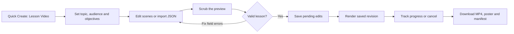
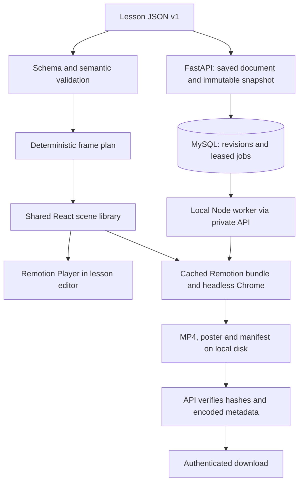

# Create lesson videos locally

Implemented September 11, 2026. TECKSTUDIO can now turn a structured lesson into a **silent 1920×1080 H.264 MP4 at 30 fps**, using the same scene components for preview and rendering. No AI provider key is needed. The first release includes title, diagram walkthrough, question/reveal and recap scenes.

## Start the product

From the project root, with the prerequisites in [Local setup](LOCAL_SETUP.md) installed:

```bash
./scripts/setup_local.sh   # first installation; downloads dependencies and the render browser
./scripts/start_local.sh   # subsequent sessions; keep this terminal open
```

Open [TECKSTUDIO](http://127.0.0.1:5173), register or log in to your local account, then choose **Quick Create → Create Lesson Video**. It creates an editable five-scene API request example. Existing lesson projects reopen in their own workspace at `/lesson-video/:projectId`.

The launcher starts MySQL on 3307, FastAPI on 5001, Vite on 5173 and one local render worker. Stop with Ctrl+C or `./scripts/stop_local.sh`. A submitted render keeps going when you close the editor tab while the services remain running. Closing the launcher stops rendering; expired attempts are recovered on restart.

## Author, preview and export



1. Set the lesson title, domain, audience, objectives, prerequisites and source notes. These describe your material; changing the audience does not automatically rewrite it.
2. Select a scene in the storyboard. Edit its content and duration, add another supported scene, or duplicate, reorder and delete scenes.
3. For a diagram, name the nodes, connect them with labeled edges and define reveal steps. Each step specifies its full active node/edge selection and optional unavailable states. Keep labels concise; split dense graphs across scenes.
4. Play or scrub the preview. Selecting a storyboard scene seeks to its start. For questions, set when the answer appears. This is a video reveal, not a graded learner interaction.
5. Click **Save**, or **Render MP4**, which saves pending changes first and submits that exact saved revision. Invalid content blocks both operations. Subsequent draft edits do not change an already submitted snapshot.
6. Follow the render history and download the MP4, poster or manifest when complete. Downloads require the owning account. The manifest records the spec, resolved frame plan, bundle/font checksums, runtime versions and media checksums.

If another tab saves first, the editor reports a revision conflict and keeps your draft. Export its JSON before reloading the server version. Unsaved draft changes live in the current tab; save before leaving. Trash/restore preserves the editable lesson, but does **not** restore old render jobs or their downloads. Projects with queued or running jobs cannot be deleted until those jobs finish or are cancelled.

## Render JSON without the application

The CLI needs installed workspace dependencies and the prepared render browser. It does not need MySQL, FastAPI, an account or a worker:

```bash
npm ci
npm run video:prepare
npm run video:render -- --spec docs/examples/lesson-video-api-request.json --out .local/exports/api-request.mp4
```

This writes `api-request.mp4`, `api-request.poster.png` and `api-request.manifest.json`. The output name must end in `.mp4`. Existing outputs are rejected; use `--overwrite` explicitly to replace them. Ctrl+C cancels the render. After initial setup, built-in scenes and fonts require no external assets.

To build templates with the developer interface:

```bash
npm run video:studio
```

The canonical starter is [packages/lesson-video/src/example.json](../packages/lesson-video/src/example.json); the [documented example](examples/lesson-video-api-request.json) contains the same data. Copy it and modify content for your topic. Import the resulting file into the product with **Import JSON**, review it, then save.

## Programmatic API flow

Authenticate using the existing `/api/auth/login` endpoint and send its bearer token. The [local API reference](http://127.0.0.1:5001/docs) exposes the exact request schemas.

| Operation | Request |
|---|---|
| Create lesson | `POST /api/lesson-videos` with `{ "spec": <valid lesson> }`, or `{}` for the starter |
| Read document | `GET /api/projects/{project_id}/lesson-video` |
| Save document | `PUT /api/projects/{project_id}/lesson-video` with `{ "expected_revision": 1, "spec": <valid lesson> }` |
| Submit render | `POST /api/video/render/remotion` with `{ "project_id": "…", "expected_revision": 2, "idempotency_key": "unique-request-id" }` |
| Status | `GET /api/video/render/{job_id}` |
| Cancel | `DELETE /api/video/render/{job_id}` |
| History | `GET /api/projects/{project_id}/video-renders?offset=0&limit=20` |
| Download | `GET /api/video/render/{job_id}/artifacts/video` (also `poster` or `manifest`) |

Use the revision returned by the last successful save. Reuse an idempotency key when retrying the **same submission** after a network failure; use a new key for a new render. A stale revision or mismatched reuse returns 409. Unsupported content returns validation errors instead of executing arbitrary code. Worker endpoints use a separate private credential and are not part of the teacher API.

## How preview and rendering agree



Frames are integers. Scene end frames are exclusive, and cuts do not overlap. The starter scene boundaries are `0, 180, 600, 1050, 1350, 1620`, giving exactly **54 seconds**. Diagram step and answer-reveal times are relative to their scene. Seeking directly to a frame computes the state from that frame; playback history is not required.

The worker claims one job at a time, renews a 60-second lease and uses a separate render process. A lost lease stops that attempt. After interruption, another claim retries an expired job, with two total attempts by default. Only the current lease may publish completion. Render cancellation becomes visible immediately; process termination follows on the next worker pulse. The API verifies the MP4 before making downloads available.

## Adapt the lesson to your learners

| Field | Starting diagram | Practice to add |
|---|---|---|
| Software fundamentals | Client → API → Database, then a failure scene | Trace the response and explain who handles failure |
| AI | Question → Retrieval → Context → Model → Answer | Explain how retrieved context can affect an answer; include a failure case |
| Cloud | Client → Load balancer → Service → Data store | Predict the effect of a service or dependency outage |
| Distributed systems | Caller → Service, with request/response and retry steps | Explain why a retry can duplicate work |
| Design systems | Token → Component → Screen | Predict which views change when a shared token changes |
| Other fields | Entities and labeled relationships from the subject | Ask for a prediction and explain the mechanism's limits |

For students, use fewer nodes and explain vocabulary. For graduates, connect the diagram to a small implementation lab outside the video. For professionals, state constraints and discuss operational tradeoffs. Revise the content and source notes for each variant. The domain field is open text, so the engine can represent subjects beyond computing without a new renderer. Domain packs, AI drafting, automated localization and batch orchestration are future work.

## Operation and troubleshooting

| Item | Location or action |
|---|---|
| Worker health | `http://127.0.0.1:5001/api/health/lesson-video`; recent heartbeat means online (30-second window) |
| Status | `.venv/bin/python scripts/local_stack.py status` |
| Worker log | `.local/renderer-process.log` |
| Worker credential | `.local/video-worker.key`, generated privately during prepare; never copy it into frontend variables |
| Bundle cache | `.local/video-bundles/<hash>/`; retain bundles referenced by retryable snapshots |
| Runtime metadata | `.local/video-runtime.json` |
| Platform artifacts | `.local/video-artifacts/<job-id>/attempt-<n>/` by default |
| Render child input | `.local/video-input-<job>-<attempt>.json`, removed after an attempt |
| Dependencies | Root `package-lock.json`; run installation from the repository root |

Completed platform outputs are retained while their jobs exist. Orphaned job folders and superseded attempts become eligible for cleanup after a ten-minute grace period. The worker checks cleanup when claiming work. Download files you want to keep before deleting a lesson. CLI exports should use a separate folder such as `.local/exports/`; the managed artifact root is reserved for job folders. Back up MySQL and lesson artifacts together. Do not delete `.local` to clear a cache: it also contains the database and credentials.

If the worker is offline, check its log and run `npm run video:prepare`, then restart the launcher. After an interrupted job, allow the lease to expire before expecting recovery. A stale bundle/version error requires restoring its recorded runtime or submitting a new render from the saved lesson. If a port is already occupied, stop the process you own; the launcher does not take over unrelated services.

For manual service operation, start the API and frontend as in [Local setup](LOCAL_SETUP.md), then run `npm run video:worker` from the root in a third terminal. A different loopback API port needs `TECKSTUDIO_API_URL` in the worker environment. By default both API and worker read the private key file; if overriding `LESSON_VIDEO_WORKER_SECRET`, set the same value in the backend configuration and the worker's process environment. The worker does not read `backend/.env` itself.

## Release limits and extension points

JSON is capped at 1 MiB, 1–30 scenes, 15–3,600 frames per scene, and 18,000 frames total (10 minutes). Diagrams allow 6 nodes, 10 edges and 12 steps; node/edge labels are at most 32 characters. These are validation limits, not a throughput guarantee. Dense graphs can still need simplification; this is a fixed left-to-right teaching layout, not a general graph layout engine.

This release uses English text, packaged Inter fonts, a light theme, one template, landscape output, hard cuts and silent video. It rejects external assets, narration and unsupported scene/output types. It does not convert Fabric projects automatically. Narration/captions, code/comparison layouts, portrait video and page-image imports are M3; reviewed domain packs, AI drafting and batches are M4. A learner portal and grading remain separate product work.

Remotion packages are pinned together at **4.0.523**. Its license is supplied at `node_modules/remotion/LICENSE.md`; it has its own terms in addition to this repository's license. The Inter font license is preserved at [renderer/public/Inter-LICENSE.txt](../renderer/public/Inter-LICENSE.txt). See the [validation record](REMOTION_VALIDATION.md) for actual test coverage, versions and portability limits.
