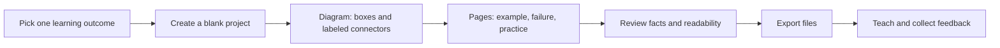

# TECKSTUDIO: start here

Reviewed September 6, 2026; Remotion implementation added September 11, 2026. This folder has no `.git` history, so the review is tied to this snapshot rather than a commit.

TECKSTUDIO is a visual authoring studio with useful building blocks for teaching. You can construct diagrams, illustrated explanations, multi-page designs and narrated clips. A course catalog, learner player, graded assessments and progress tracking are future work.

| Your next step | Open |
|---|---|
| Understand the product visually | [Visual guide](../frontend/public/guide.html), or [running local guide](http://127.0.0.1:5173/guide.html) |
| Run everything on your Mac | [Local setup](LOCAL_SETUP.md) |
| Build a first lesson and adapt it to different audiences | [Teaching playbook](TEACHING_PLAYBOOK.md) |
| Understand the architecture and what to improve | [Product deep dive](PRODUCT_DEEP_DIVE.md) |
| Create programmatic lesson videos with Remotion | [Usage guide](REMOTION_LOCAL_GUIDE.md) — editor, JSON, CLI, API and visual diagrams |
| Understand the implemented release and next milestones | [Implementation record](REMOTION_IMPLEMENTATION_PLAN.md), [integration design](REMOTION_INTEGRATION_PLAN.md) |
| See exactly what was checked | [Remotion validation](REMOTION_VALIDATION.md), [original review](VALIDATION.md) |

## Start the local product

From the project root:

```bash
./scripts/setup_local.sh   # first time; installs dependencies and initializes local data
./scripts/start_local.sh   # each work session; keep this terminal open
./scripts/stop_local.sh    # from another terminal when you want to stop
```

Open [TECKSTUDIO](http://127.0.0.1:5173). Use the registration form to create your own local account. An account in a hosted copy of this product does not automatically exist in this database. Stop with Ctrl+C in the launcher terminal. Restart with the same command; your projects persist.

The local smoke check also created an editable **Teaching starter — Request lifecycle** example. Its separate demo login is saved privately in `.local/demo-account.json`. Register your own account for your real course material; the demo account contains verification fixtures.

## The first lesson to build

For an animated lesson, choose **Quick Create → Create Lesson Video**. The API request starter already has an outcome, request walkthrough, failure case, question and recap. Edit the scenes, preview, save and render a 54-second silent landscape MP4. The [Remotion guide](REMOTION_LOCAL_GUIDE.md) also explains how to generate it from JSON without an account or database.

Build **“What happens when I send an API request?”** Start with three boxes—Client, API, Database—and label the arrows. Duplicate the page to add a cache, then add a failure case and a question. Export each page as PNG/PDF, or arrange the pages in the video timeline.



For now, distribute exported files through your existing classroom or LMS. The current share page does not render a learner-ready lesson. A localhost link points to the viewer's own machine, so it will not distribute your work to students on other computers.

## What this review changed

- Added isolated local initialization, startup and health-check commands, plus a Python dependency snapshot.
- Made Vite output portable (`frontend/dist`) and aligned its media proxy with frontend environment settings.
- Fixed database URL construction for passwords containing reserved characters.
- Resolved four existing blocking lint errors without refactoring the teaching editor.
- Added these guides and a self-contained visual document. Larger product improvements are recommendations, not completed features.
- Added a separate Lesson Video workspace, shared scene engine, local CLI renderer, saved revisions, immutable render snapshots, durable jobs and authenticated downloads. The launcher now runs the local render worker as its fourth service.
