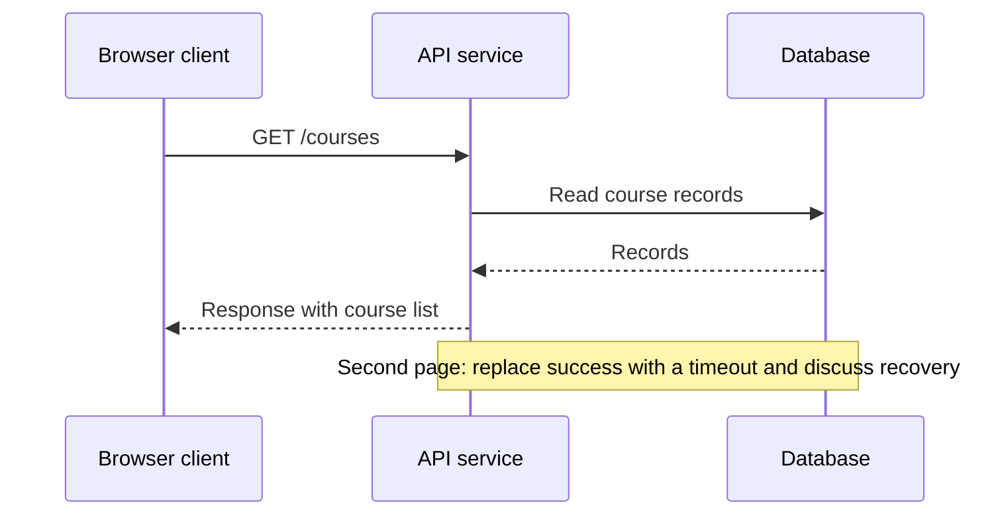
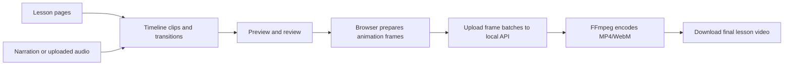

# Build lessons with TECKSTUDIO

This guide maps the current code's UI labels to teaching tasks. Browser verification was declined during this review, so treat the click paths as source-traced instructions. [Validation](VALIDATION.md) lists runtime checks separately.

## Use one repeatable lesson structure

Create one small learning outcome per lesson: “Trace a request through a cache” is easier to teach and assess than “Understand distributed systems.” Write the objective, prerequisites and sources in your teacher notes for now; the editor has no dedicated lesson metadata fields yet.

| Page/scene | What to show | What to ask |
|---|---|---|
| 1. Outcome and hook | A concrete problem or question | What do you predict will happen? |
| 2. Mechanism | A small labeled diagram with one highlighted path | Explain the path in your own words |
| 3. Worked example | Realistic input, intermediate states, output | Which step changes the result? |
| 4. Exception or misconception | Failure, counterexample or tradeoff | Why does the first explanation need qualification? |
| 5. Practice and recap | A similar problem and a concise takeaway | Solve it, then justify your answer |

This is an authoring convention, not an automatic five-page wizard. Use duplicated pages and text boxes to implement it today.

## Adjust the same lesson for three audiences

| Dimension | Students beginning the topic | College graduates | Professionals |
|---|---|---|---|
| Prerequisites | Explain every new term | Connect to a small program/project | State system/context assumptions |
| Diagram | 3–5 entities, one primary path | Add implementation details and state | Add scale, boundaries, failure/recovery paths |
| Example | Familiar analogy followed by the real mechanism | A runnable exercise outside TECKSTUDIO | A design or operational decision |
| Practice | Label arrows or predict one step | Implement or debug a small case | Compare tradeoffs under constraints |
| Evidence | Clear source and teacher explanation | Documentation plus code | Documentation, measurements and architecture assumptions |

The examples below are lesson designs, not claims that the application executes code or simulates cloud infrastructure.

## First lesson: request → API → database

**Outcome:** the learner can trace a read request and distinguish application processing from data retrieval.

1. Start the local stack, open the product and register a local account. On Home use **Create Poster** for a blank design, or create a project from **Projects**. Name it `Software / Request lifecycle / Beginner / v1`.
2. In the editor, use **Diagram** in the left toolbar. Add three cards labeled `Client`, `API service` and `Database`. Use meaningful subtitles such as `sends request`, `validates and reads`, and `stores records`. Choose icons that reinforce meaning.
3. Connect Client → API and API → Database. Use the Diagram panel's source/target and anchor controls. Label the forward path `GET /courses`, then the lookup `read course list`. Add a return path or a numbered explanation below the diagram. An arrow should describe an interaction, not just decorate a layout.
4. Use **Text** to add the title, objective and a concrete input/output example. Use **Layers** to name objects and keep text above background panels. Use **Props** to tune selected objects.
5. Open **Pages**, then **Duplicate page**. Change the title to `What if the database is unavailable?` Add a failure indicator and explain that the API needs an error/timeout strategy. Add another page containing a prediction question and a teacher answer page. Use **Add Page** when you want an empty page.
6. Reopen the saved project before class to confirm persistence. Use the top **Download** menu for a quick PNG/JPG/SVG or the right-side **Export** tab for PDF and other settings. Export each desired page individually; current PDF export does not assemble the lesson.
7. Teach from the images/PDFs. Ask the question before showing the answer. Record student misconceptions in your external notes, then update the lesson.



This diagram is a conceptual teaching example; the built-in product does not have a `/courses` endpoint. Build the visual using editor cards/connectors.

**Graduate adaptation:** add request validation, status codes and a small API lab in a separate development environment. **Professional adaptation:** add cache behavior, latency budget, authorization, observability and failure handling.

## Start from the built-in technical templates

In the editor select **Templates**, then look for **Technical / Infographic**. These special templates are in the editor source and may not appear as equivalent records in dashboard search.

| Template | Current canvas | Useful starting point |
|---|---|---|
| AI Chat System Architecture | 1080×1350 | Request routing, orchestration, model calls and supporting services |
| Distributed System Architecture | 1440×1000 | Services, communication and data platform explanation |
| Technical AI Workflow Infographic | 1080×1350 | Inputs, process and outputs |
| Prompt Context Harness Infographic | 1080×1350 | Separating prompt, context and surrounding execution controls |

Apply templates to a fresh project or duplicated page. Some template functions clear/rebuild the canvas and resize it. Keep an exported copy of important work before replacing an existing design. Edit the actual labels and relationships; do not assume a polished preset is correct for your lesson.

Use **Diagram** for architecture node/connector controls. **Elements** provides additional visual parts, shapes and specialist technical pieces. **Text**, **Uploads**, **Layers**, **Pages** and **History** are left-panel tabs. On the right, **AI**, **Colors**, **Assets**, **Effects**, **Pattern**, **Resize**, **Brand**, **Export**, **Audit** and **Props** provide supporting tools. The right tab strip scrolls horizontally and can be collapsed to enlarge the canvas.

## Turn pages into a short narrated video

Before video, another quick static option is **AI → poster prompt → Generate Editable Poster**. Enter a prompt containing “5 numbered cards” or “infographic” to expose the editable-layout path, select a theme and 3–9 cards, then edit the resulting title, cards and CTA. The backend tries Gemini when configured; otherwise it returns `local:validated-poster-spec`, a topic-based template fallback. This can be used without a key, but its generic content is not AI research and may not match a narrow topic. It creates one poster, not a multi-scene lesson. Keep technical text editable and review each card.

1. Plan a short sequence first. Start with 20–40 seconds and a few pages so you can verify timing before a long render.
2. Use **Pages → Add Page to Timeline** for the pages you want. Switch the top toolbar to video mode if the timeline is not visible. Arrange clips and set duration/transition controls in the timeline.
3. For a ready-made example, use **Technical Reel** in the timeline. It uses five AI-engineering scenes: LLM fundamentals, foundations of AI engineering, prerequisites, backend core and engineering toolbelt. Its base durations total 18 seconds before transitions; it is a specific preset, not automatic conversion of arbitrary course content.
4. Animate only what helps the explanation: reveal a card, highlight the active step, move a dot along a request path. Avoid running all connector animations at once. For reduced-motion material, export static steps or disable motion.
5. Add narration using the timeline audio tools or its voice recorder. Recording may require browser microphone permission. Do not rely on a recording until you have reopened the project and verified that its source still resolves; long-term audio persistence is a review item.
6. Preview from beginning to end. Check the first/last frame, text readability, narration alignment and the intended question pause.
7. Export MP4 or WebM. The current backend accepts **1080×1350** or **1080×1920**, at **24, 30 or 60 fps**, with draft/standard/high quality. Start with draft at 24/30 fps. The 1440×1000 distributed template needs adaptation to an accepted composition for video.
8. Keep the browser tab open while frames are prepared and uploaded. Download the final output to your lesson folder; temporary backend files are subject to cleanup.



Animation is a presentation of authored states. Live parameter controls, executable code cells, automatic question scoring and learner analytics are not implemented in this flow. Captions/transcripts should be prepared separately until the product has a verified native workflow.

## Five technical concept recipes

### AI: retrieval-augmented answers

**Outcome:** distinguish model knowledge from retrieved context. Start with **Technical AI Workflow Infographic**. Draw two labeled lanes: document preparation (`documents → chunks → embeddings/index`) and question time (`question → retrieve → context + question → model → answer with references`). Add a page with an irrelevant retrieved passage to discuss why retrieval does not guarantee correctness.

- Student task: sort cards into preparation and question-time steps.
- Graduate task: implement a small retrieval example outside the editor; compare retrieved passages with the answer.
- Professional task: compare freshness, access controls, latency and evaluation requirements for a real use case.
- Teacher check: distinguish retrieval from model training, and label synthetic examples as examples.

### Software fundamentals: a function call and the call stack

**Outcome:** trace inputs, local state and return values. Start with a blank canvas and use code/terminal panels plus text. Show `total = price * quantity` as a worked example. On successive pages, highlight input binding, calculation and return. Add a nested function to show stack frames and a bad-input case.

- Student task: predict the output for two inputs.
- Graduate task: trace a recursive function with a base case in an external debugger.
- Professional task: connect the trace to stack traces and error propagation in a production language.
- Teacher check: use real line breaks in text fields; code panels are visual text, not runnable code.

### Cloud: a request through a web application

**Outcome:** explain why a cloud application has separate traffic, compute and storage responsibilities. Start with **Distributed System Architecture**, simplify to browser → edge/load balancer → app → database/object storage. Draw an explicit boundary around the application network and distinguish stored files from structured data.

- Student task: match each component to its responsibility.
- Graduate task: map an application they built to the diagram.
- Professional task: add scaling, identity, observability and disaster-recovery assumptions.
- Teacher check: use generic icons first; consult current vendor documentation when making provider-specific claims. A cloud icon does not imply automatic security or resilience.

### Distributed systems: retries and duplicate work

**Outcome:** explain why retries can repeat a side effect. Use **Diagram** for client → order service → payment-like side-effect stub. Duplicate pages for `request sent`, `operation succeeds but response is lost`, `client retries`, and `deduplication by request key`. Use a purely illustrative transaction, not a real payment integration.

- Student task: identify why the sender cannot infer success from a missing response.
- Graduate task: implement a fake idempotent endpoint in a separate lab.
- Professional task: discuss key scope, expiry, storage consistency and concurrent retries.
- Teacher check: avoid claiming that an arrow animation proves exactly-once execution. Show assumptions and remaining failure cases.

### Design systems: semantic tokens and component states

**Outcome:** distinguish primitive tokens, semantic roles and component usage. Use **Brand** for your palette/fonts and cards for `blue-600 → action-primary → button fill`. Duplicate the page for default, hover, focus, disabled and error states. Include text labels and visible focus indicators so color is not the only distinction.

- Student task: apply one semantic color consistently to a simple interface.
- Graduate task: map visual tokens to CSS variables in a separate code project.
- Professional task: discuss theming, accessibility, versioning and migration across a component library.
- Teacher check: the Brand Kit is a reusable styling aid; it is not a full token compiler, code generator or Figma synchronization system.

## Extend the same patterns into other fields

| Field | Visual pattern to reuse | Example lesson | Additional needs |
|---|---|---|---|
| Biology | Labeled parts + process sequence | Flow through a simplified cell pathway | Accurate domain illustrations and reviewed terminology |
| Mechanical/electrical engineering | Entities, connections and state changes | Energy transfer through a simple system | Units, equations, standards and domain validation |
| Mathematics | Worked example + progressive reveal | Derivative as local rate of change | Equation typesetting and real plotted data; generic shapes alone are insufficient |
| Business/operations | Swimlane/process + decision branch | Order fulfillment and exception handling | Valid operational assumptions and realistic cases |
| Humanities | Timeline + comparison + source excerpts | Compare explanations of a historical event | Citations, context, source provenance and interpretation |

The reusable framework is **outcome → mechanism → worked example → exception → practice**. Expand the content packs, specialist notation and review criteria for each field while retaining the authoring engine.

## Use AI with a structured teaching brief

Use the AI assistant for drafting copy, examples or visual suggestions after configuring a provider. The prompt below is a manual briefing template; pasting it does not create a native structured lesson or quiz automatically.

```text
Topic: [one narrow concept]
Audience: [students / graduates / professionals]
Prerequisites: [what they already know]
Outcome: After this lesson, the learner can [observable action].
Source material: [paste the relevant verified passage or notes]

Draft five scenes: hook, mechanism, worked example, exception, practice.
For each scene provide:
- a short title and explanation;
- the diagram entities and labeled relationships;
- narration text;
- one likely misconception;
- a question and teacher answer.

Keep unsupported claims out. Mark missing information explicitly.
Use editable text and shapes for technical labels. Suggest artwork only
where it supports understanding. Separate facts from analogies.
```

Review the result against the sources before copying it onto pages. Generated raster artwork may contain incorrect text; keep important technical labels as editable text objects.

## Reuse, delivery and review

Create a Brand Kit for each course or organization. Use predictable project names such as `AI / Retrieval / Graduate / v1`. Save a master template when available and apply it to new projects; avoid editing your only master copy. Keep an external folder containing exported pages/video, sources, narration, teacher notes and the answer key.

Before teaching, reopen the project, inspect text at presentation size, check connector meaning, verify export and review the practice answer. The **Audit** panel gives visual hints; its score is not evidence that the facts, reading order or accessibility requirements are satisfied.

Deliver PNG/PDF/video through your existing LMS or screen-share the editor. The current public share page is incomplete, and `127.0.0.1` URLs only work on the same machine. Use [the roadmap](PRODUCT_DEEP_DIVE.md) for learner view, course organization, assessments, accessible output and progress tracking.
